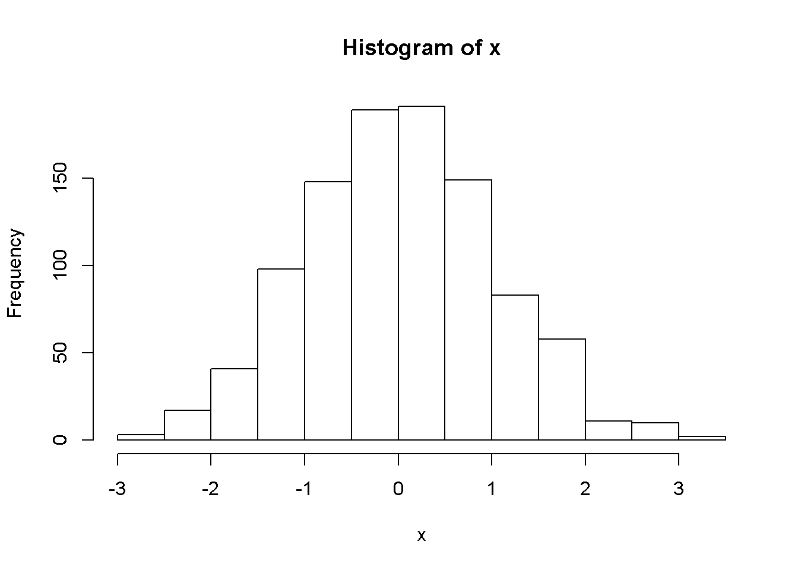

# History of the BrailleR Project {#History}

I am one of only two blind people in the world today who gained employment as full-time lecturers of statistics, that is, teaching statistics classes and doing research in theoretical matters as against applying statistical techniques. For years, I tried to keep my blindness separate from my research but I took some opportunities that came my way and heeded the advice of some colleagues to put more energy into improving the ability of blind students around the world to have greater access to statistics courses and statistical understanding. This document shows you a bit more insight into how I (with the help of some useful collaborations)  got the BrailleR package to where it is now.

## My background


My adult life has been centred around Massey University, initially as an extramural student and then studying on campus. I have undergraduate degrees in Finance and Operations Research,  a Master's degree in Operations Research and a PhD in Statistics. I was a Graduate Assistant from 1998 to 2002, and then Assistant Lecturer from January 2003 to June 2004 when I became a Lecturer in Statistics. I was promoted to Senior Lecturer in late 2014.

While I don't find it important, I do get asked about the condition that caused my blindness. It is Retinitis Pigmentosa. I do have some light perception, and can make use of it in familiar surroundings for orientation but it has no value to me for reading anything at all. I chose to work with screen reading software when I started university and obtained my first computer because my residual vision at the time was limiting my reading speed. I have therefore operated a computer as a totally blind user throughout my adult life.

I did not learn braille until after I completed my PhD. This might seem strange, but there was very little material in a suitable digital format for me to read throughout my student life. Things have changed and I now spend a lot more time reading material and doing programming where the accuracy of braille is absolutely necessary. Braille has now become a very important part of my working life and I have a braille display connected to my computer most of the time.


## Getting the BrailleR Project started


I used to keep my research interests separate from my blindness, but  I was regularly called upon to discuss how a blind person could study and teach Statistics by many people within New Zealand and occasionally from overseas.  In 2009, I attended the Workshop on E-Inclusion in Mathematics and Science (WEIMS09) where I met other people interested in improving the success rates of blind students in the mathematical sciences. My paper was about accessibility of statistics courses, but I did point out the usefulness of R in preference to other tools I had used to that point in time [@Godfrey2009AccessiblePaper].

I discovered that there is room for me to take a leading role in the development of ideas that can help other blind people learn about statistical concepts.  I have been invited to all six Summer University events run by the organizers of the International Conference on Computers Helping People (ICCHP), but have been unable to attend twice due to the high cost of transporting me to Europe. I have delivered an introductory workshop on using R at four of these events [@Godfrey2011SU-R; @Godfrey2013SU-R; @Godfrey2014SU-R, and @Godfrey2016SU-R.

Having observed the attendees at the 2011 Summer University as they came to grips with R, I knew there was more I could do to help them and other blind students. I started work on the BrailleR package [@Rpkg-BrailleR] in the second half of 2011 and first proposed it could work for blind users at the Digitisation and E-Inclusion in Mathematics and Science (DEIMS12) workshop held in Tokyo during February 2012 [@Godfrey2012BrailleRPaper].


I wasn't to know the value of another talk I gave at DEIMS12 for another two years;  this second talk and associated conference paper focused on how I was using Sweave to create accessible statistical reports for me and more beautifully formatted ones for my statistical consulting clients.
[@Godfrey2012PuttingPaper]. I now know that the groundwork I had done contributed to my desire to present my workflow as a workshop at the 5^th^ Summer University in 2014 [@Godfrey2014SU-Sweave]. 
It also stood me in good stead for the work that followed on the `BrailleR` package as it developed in late 2014 and early 2015.

## The starting point example 

The basic graph that has been used for almost every presentation of the `BrailleR` package is a histogram. There is a more detailed example, but the following commands create a set of numbers that can be kept for further processing once the graph has been created. It is the re-processing of these numbers that leads to the text description that follows.


```r
library(BrailleR)
```

```
## The BrailleR.View,  option is set to FALSE.
```

```
## 
## Attaching package: 'BrailleR'
```

```
## The following objects are masked from 'package:graphics':
## 
##     boxplot, hist
```

```
## The following object is masked from 'package:utils':
## 
##     history
```

```
## The following objects are masked from 'package:base':
## 
##     grep, gsub
```


```r
x=rnorm(1000)
VI(hist(x))
```

<div class="figure">

<p class="caption">(\#fig:hist)A histogram of 1000 random values from a normal distribution</p>
</div>

```
## This is a histogram, with the title: Histogram of x
## "x" is marked on the x-axis.
## Tick marks for the x-axis are at: -3, -2, -1, 0, 1, 2, and 3 
## There are a total of 1000 elements for this variable.
## Tick marks for the y-axis are at: 0, 50, 100, and 150 
## It has 12 bins with equal widths, starting at -3 and ending at 3 .
## The mids and counts for the bins are:
## mid = -2.75  count = 9 
## mid = -2.25  count = 20 
## mid = -1.75  count = 51 
## mid = -1.25  count = 94 
## mid = -0.75  count = 150 
## mid = -0.25  count = 180 
## mid = 0.25  count = 184 
## mid = 0.75  count = 157 
## mid = 1.25  count = 93 
## mid = 1.75  count = 42 
## mid = 2.25  count = 17 
## mid = 2.75  count = 3
```

This first example showed me what was possible if only I could get a few things sorted out. All histograms  are created by a function that stores the results (both numeric and text details) and calls this stored set of values a "histogram". The main issue is that storing the set of details is not consistent in R, nor is the fact that the stored object gets given a "class" to tell me what type of object it is. This problem haunted me for quite some time because I was talking to the wrong people about the problem; it was time to find people that held the solution instead of talking to the people that would benefit if a solution was found.

## Why just plain text?

The first initiative of `BrailleR` was to turn information presented in a visual medium into a medium that is simple to work with, efficient, and complementary to the skill set of as wide a group of blind people as possible. With this in mind, a plain text solution for gaining access to visual information was favoured above tactile images as there is no need for any additional adaptive technology (hardware or software) over that used for the blind person's other work. 
Information presented in text is readable in braille or heard via synthetic speech, and is therefore only limited to the user's skill set.

Other research projects are progressing the creation of tactile images that replace the printed graphics sighted people deal with all the time in statistical work. Tactile images do have a role to play in educating blind people and providing them with access to information, but their greatest drawback remains their lack of immediacy. Rendering a graphic into a master file complete with braille labels, and then producing this for consumption are tasks receiving much attention, but the value for such efforts is probably greatest for situations where one master can be used to create multiple copies for wider consumption such as the conversion of textbooks into braille. Some preliminary investigations into the ability to create tactile image versions of graphs created in R have been made as part of the wider BrailleR Project.  

Under a sighted paradigm, many graphs in statistical work are developed for one-time use and discarded almost immediately. 
It may be some time until the effectiveness of tactile image hardware and software  is ready to deliver this outcome for all blind users of R; in the meantime, we must find ways of gaining access to the graphical information without reliance on another person's ability to translate the visual medium into something more useful for us. We must also acknowledge here that the number of blind people with their own tactile image hardware and software is regrettably low. Even though it is possible to directly export a graph created in R to an embosser, use of this practice is not yet commonplace.
 Perhaps we can look forward to the time when most blind people can have access to a refreshable tactile display that can display two-dimensional images that compare with the best that is possible in hard copy today.

Sonification is considered by many to be an alternative to production of tactile images for a blind audience. Work on sonifying statistical graphs is being considered, but is at present best described as experimental. Several concerns must be overcome before  sonification can be claimed a truly useful method for interpretting data. There is an assumption made frequently by correspondents with this author that lack of vision implies  a blind person has superior aural ability . This may be true for some blind people, but it is not universally true. We must be sure that the interpretation gained through sound is comparable to the interpretation that a graph in visual form would convey. Proponents of sonification often suggest that sound provides a different interpretation to a visual display. If they are correct, then sonification cannot be a true alternative to a visual graph. The same, of course, can be said for the difference between the interpretation obtained through touching tactile images. In both cases, the solution for blind users must be that the visual representation can be converted to a useful format when blind users need it, without the assistance of a sighted person to check the validity of the outcome.


## Exposure of the BrailleR package outside the blind community

It was obvious to me that getting the word out to the masses about the usefulness of R for blind students and professionals was crucial. I started to compile my notes built up from various posts made to email groups and individuals over the years, as well as the lessons I learned from attendance at the 2^nd^ Summer University event. This led to the eventual publication of my findings in [@GodfreyRJournal]. I know that this was a worthwhile task because it was read by teachers of blind students who were already using R for their courses. One such person tested R and a screen reader and managed to find a solution to a problem posed in   @GodfreyRJournal which led to an addendum [@GodfreyErhardtRJournalAddendum]. 

I presented some of my work via a poster [@Godfrey2013BlindnessPoster] at the NZ Statistical Association conference in Hamilton during November 2013. This 'poster' presentation was developed as a multimedia presentation so that the audience could observe video footage, handle tactile images and be able to talk with me about the BrailleR Project. The plan to get talking with people instead of talking at them worked and I started a really useful collaboration with Paul Murrell from the University of Auckland. His major contributions didn't feature in the BrailleR package for some time, but we're making some really nice progress. Paul is an expert in graphics, especially their creation and manipulation in R. Our discussions about graphics has yielded a few titbits for my own work that have been tested for the package. We've been working on how to make scalable vector graphics that can be augmented to offer blind users greater interactivity and therefore hopefully greater understanding [see @GodfreyMurrell2016TactileGraphsPaper].


## Reviewing statistical software

I have been asked about the use of R in preference to other statistical software by many blind students, their support staff, and  their teachers. 
Eventually I joined forces with the only other blind person to gain employment as a lecturer of statistics (Theodor Loots, University of Pretoria) to compare the most commonly used statistical software for its accessibility [@GodfreyLoots2014JSS]. 
I summarised this paper at the 5^th^ Summer University event [@Godfrey2014SU-StatsSoft], and offered a similar presentation at the 6^th^ Summer University event [@Godfrey2016SU-StatsSoft] with a few updates. 
It is important to keep abreast of developments, because the statistical software changes, and so does the screen reading software that gives us access to the mainstream statistical software.


## Attendance at UseR conferences

On my way to the 5^th^ Summer University event, I managed to attend the principal conference for R users (UseR!2014) in Los Angeles where I presented my findings [@Godfrey2014BlindUseROral]. 
Perhaps the most valuable outcome of this conference was the ability to attend a tutorial on use of the `knitr` package [@Rpkg-knitr] and then talk to its author, Yihui Xie. 
I'd already seen the `knitr` package before attending UseR!2014 and implemented it for some of my teaching material by updating the Sweave documents already in use.  
The real value came in realising what I could probably do if I used R markdown to do a few things I had found very hard using the Sweave way of working. 
More specifically, generating an R markdown file (Rmd) from an R script was much easier than generating a Sweave file (Rnw). 
Writing the convenience functions for the `BrailleR` package started to look very achievable at this point, and so work began. 
I dug out some old work that wasn't fit for sharing and converted it to the markdown way of working. 
There has been sufficient progress in the BrailleR Project that I presented it at UseR!2015 [@Godfrey2015BaseRWeepsOral]. In 2016, I presented my findings on writing (and therefore reading) R markdown documents for (and by) blind users [@GodfreyBilton2016UseROral].


## The ongoing work

The introduction of R markdown to the BrailleR package made a huge difference. 
I've been able to write enough example code that once I found a friendly postgraduate student (Timothy Bilton) to put some time into it, we've managed to add more convenience functionality. 
Timothy improved some of my earlier work and tried a few things of his own. 
This left me with the time to add increased functionality for helping blind users get into  markdown for themselves.

One of my irritations of working with markdown is that everyone else seems to write markdown and check their findings using RStudio [@RStudio], which remains inaccessible for me and other screen reader users. I took an old experiment where I wrote an accessible text editor in wxPython, and with the help of a postgraduate student from Computer Science (James Curtis) we've modified it to process Rmd files. 
The `WriteR` application is now beyond experimental but there is still more to do on making it truly useful [@GodfreyCurtis2016WriteRPaper]. 
In 2018, I received a great deal of assistance from Marshall Flax who was able to help develop `WriteR` into a tool that could be very useful to blind people wishing to write and process R markdown files.

## Acknowledgements


Contributions to the BrailleR Project are welcome from anyone who has an
interest. I will acknowledge assistance in chronological order of the
contributions I have received thus far.

Greg Snow was the first person to assist when he gave me copies of the
original R code and help files for the R2txt functions that were part of
his `TeachingDemos` package [@Rpkg-TeachingDemos].

The Lions clubs of Karlsruhe supported my attendance at the 3^rd^ Summer
University event in 2013. This gave me the first opportunity to
put the package in front of an audience that I hope will gain from the
package's existence. 

I've already mentioned the following contributors above:Paul Murrell, Yihui Xie, Timothy Bilton, James Curtis, and Marshall Flax.

I also need to acknowledge the value of attending the Summer University events.  I gain so much from my interactions with the students who attend, the other workshop leaders who give me feedback, and the other professionals who assist blind students in their own countries.
 


## References
