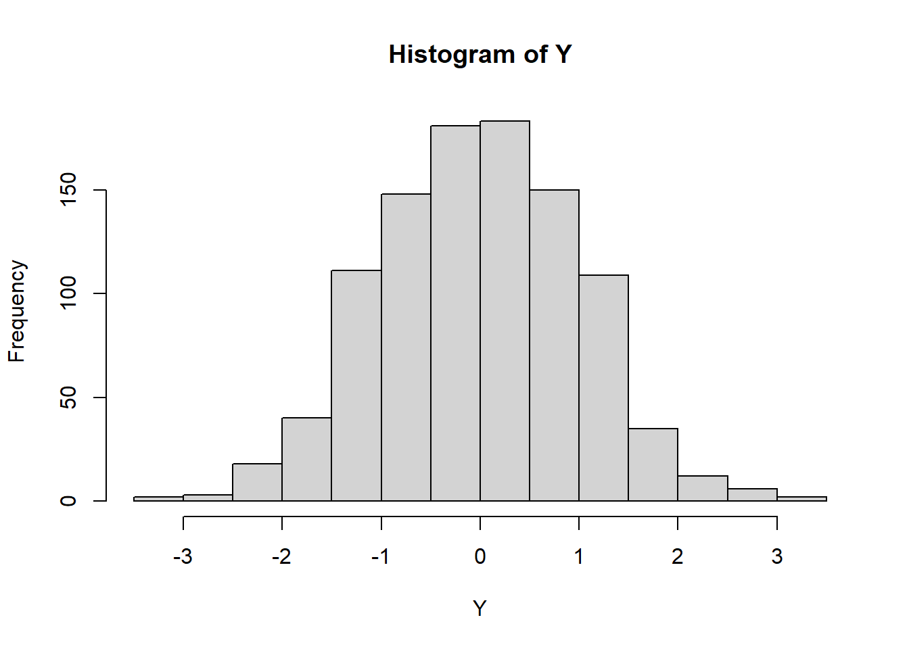

# Some basic examples {#VI}

This chapter presents some examples of text output generated by the `VI()` command of the `BrailleR` package. These examples generate output that is displayed in the R session just like any output from standard R commands. Please note however that not all `VI()` commands behave in this fashion; some more advanced uses of `VI()` are discussed in a later chapter. 


You will need the `BrailleR` package to be ready for use to follow along with the examples in this chapter. Do this by issuing the command `library(BrailleR)` now.


## Histograms

The first and most commonly used example demonstrating the value of the BrailleR  package to a blind user is the creation of a histogram.


```r
x=rnorm(1000)
VI(hist(x))
```

<div class="figure">

<p class="caption">(\#fig:hist)A histogram of 1000 random values from a normal distribution</p>
</div>

```
This is a histogram, with the title: Histogram of x
"x" is marked on the x-axis.
Tick marks for the x-axis are at: -3, -2, -1, 0, 1, 2, and 3 
There are a total of 1000 elements for this variable.
Tick marks for the y-axis are at: 0, 50, 100, 150, and 200 
It has 13 bins with equal widths, starting at -3.5 and ending at 3 .
The mids and counts for the bins are:
mid = -3.25  count = 1 
mid = -2.75  count = 3 
mid = -2.25  count = 18 
mid = -1.75  count = 41 
mid = -1.25  count = 97 
mid = -0.75  count = 139 
mid = -0.25  count = 191 
mid = 0.25  count = 199 
mid = 0.75  count = 164 
mid = 1.25  count = 89 
mid = 1.75  count = 40 
mid = 2.25  count = 13 
mid = 2.75  count = 5
```

The `VI()` command actually calls the `VI.histogram()` command as the `hist()` command creates an object of class "histogram". This means we can tailor the output to the information needed for any histogram created using the `hist()` command.

### Important features

The `VI()` command has added to the impact of issuing the `hist()` command as the actual graphic is generated for the sighted audience. The blind user can read from the text description so that they can interpret the information that the histogram offers the sighted world.

The above example showed the standard implementation of the `hist()` function. The `hist()` function of the `graphics` package does not store the additional arguments that improve the visual attractiveness. The solution (perhaps temporary) is to mask the original function with one included in the `BrailleR` package that calls the `graphics` package function, and then adds extra detail for any added plotting arguments.

This is best illustrated using the example included in the `BrailleR::hist()` function.


```r
example(hist)
```

```

hist> x=rnorm(1000)

hist> # the stamdard hist function returns
hist> MyHist=graphics::hist(x, xlab="random normal values", main="Example histogram (graphics package)")
```


```

hist> #dev.off()
hist> MyHist
$breaks
 [1] -3.5 -3.0 -2.5 -2.0 -1.5 -1.0 -0.5  0.0  0.5  1.0  1.5  2.0  2.5  3.0
[15]  3.5

$counts
 [1]   1   7  17  40 107 138 194 181 145 101  45  16   6   2

$density
 [1] 0.002 0.014 0.034 0.080 0.214 0.276 0.388 0.362 0.290 0.202 0.090
[12] 0.032 0.012 0.004

$mids
 [1] -3.25 -2.75 -2.25 -1.75 -1.25 -0.75 -0.25  0.25  0.75  1.25  1.75
[12]  2.25  2.75  3.25

$xname
[1] "x"

$equidist
[1] TRUE

attr(,"class")
[1] "histogram"

hist> # while this version returns
hist> MyHist=hist(x, xlab="random normal values", main="Example histogram (BrailleR package)")
```


```

hist> #dev.off()
hist> MyHist
$breaks
 [1] -3.5 -3.0 -2.5 -2.0 -1.5 -1.0 -0.5  0.0  0.5  1.0  1.5  2.0  2.5  3.0
[15]  3.5

$counts
 [1]   1   7  17  40 107 138 194 181 145 101  45  16   6   2

$density
 [1] 0.002 0.014 0.034 0.080 0.214 0.276 0.388 0.362 0.290 0.202 0.090
[12] 0.032 0.012 0.004

$mids
 [1] -3.25 -2.75 -2.25 -1.75 -1.25 -0.75 -0.25  0.25  0.75  1.25  1.75
[12]  2.25  2.75  3.25

$xname
[1] "x"

$equidist
[1] TRUE

$main
[1] "Example histogram (BrailleR package)"

$xlab
[1] "random normal values"

$ExtraArgs
$ExtraArgs$main
[1] "Histogram of x"

$ExtraArgs$xlab
[1] "x"

$ExtraArgs$ylab
[1] "Frequency"

$ExtraArgs$sub
[1] ""


$NBars
[1] 14

$par
$par$xaxp
[1] -3  3  6

$par$yaxp
[1]   0 200   4


$xTicks
[1] -3 -2 -1  0  1  2  3

$yTicks
[1]   0  50 100 150 200

attr(,"class")
[1] "Augmented" "histogram"

hist> # The VI() method then uses the extra information stored
hist> VI(MyHist)
This is a histogram, with the title: Histogram of x
"x" is marked on the x-axis.
Tick marks for the x-axis are at: -3, -2, -1, 0, 1, 2, and 3 
There are a total of 1000 elements for this variable.
Tick marks for the y-axis are at: 0, 50, 100, 150, and 200 
It has 14 bins with equal widths, starting at -3.5 and ending at 3.5 .
The mids and counts for the bins are:
mid = -3.25  count = 1 
mid = -2.75  count = 7 
mid = -2.25  count = 17 
mid = -1.75  count = 40 
mid = -1.25  count = 107 
mid = -0.75  count = 138 
mid = -0.25  count = 194 
mid = 0.25  count = 181 
mid = 0.75  count = 145 
mid = 1.25  count = 101 
mid = 1.75  count = 45 
mid = 2.25  count = 16 
mid = 2.75  count = 6 
mid = 3.25  count = 2
```


### Warning

The `VI()` function is partially reliant on the use of the `hist()` function that is included in the `BrailleR` package. If a histogram is created using a command that directly links to the original `hist()` command found in the `graphics` package, then the `VI()` command's output will not be as useful to the blind user. This mainly affects the presentation of the title and axis labels; it should not affect the details of the counts etc. within the histogram itself.

This behaviour could arise if the histogram is sought indirectly. If for example, a function offers (as a side effect) to create a histogram, the author of the function may have explicitly stated use of the `hist()` function from the `graphics` package using `graphics::hist()` instead of `hist()`. Use of `graphics::hist()` will bypass the `BrailleR::hist()` function that the `VI()` command needs. This should not create error messages, but may result in some strange and possibly undesirable output.


## Basic numerical summaries

The standard presentation of a summary of a data frame where each variable is given its own column is difficult for a screen reader user to read as the processing of information is done line by line. For example:


```r
summary(airquality)
```

```
     Ozone           Solar.R           Wind             Temp      
 Min.   :  1.00   Min.   :  7.0   Min.   : 1.700   Min.   :56.00  
 1st Qu.: 18.00   1st Qu.:115.8   1st Qu.: 7.400   1st Qu.:72.00  
 Median : 31.50   Median :205.0   Median : 9.700   Median :79.00  
 Mean   : 42.13   Mean   :185.9   Mean   : 9.958   Mean   :77.88  
 3rd Qu.: 63.25   3rd Qu.:258.8   3rd Qu.:11.500   3rd Qu.:85.00  
 Max.   :168.00   Max.   :334.0   Max.   :20.700   Max.   :97.00  
 NA's   :37       NA's   :7                                       
     Month            Day      
 Min.   :5.000   Min.   : 1.0  
 1st Qu.:6.000   1st Qu.: 8.0  
 Median :7.000   Median :16.0  
 Mean   :6.993   Mean   :15.8  
 3rd Qu.:8.000   3rd Qu.:23.0  
 Max.   :9.000   Max.   :31.0  
                               
```

The `VI()` command actually calls the `VI.data.frame()` command. It then processes each variable one by one so that the results are printed  variable by variable instead of summary statistic by summary statistic. For example:

```r
VI(airquality)
```

```

The summary of each variable is
Ozone: Min. 1   1st Qu. 18   Median 31.5   Mean 42.1293103448276   3rd Qu. 63.25   Max. 168   NA's 37  
Solar.R: Min. 7   1st Qu. 115.75   Median 205   Mean 185.931506849315   3rd Qu. 258.75   Max. 334   NA's 7  
Wind: Min. 1.7   1st Qu. 7.4   Median 9.7   Mean 9.95751633986928   3rd Qu. 11.5   Max. 20.7  
Temp: Min. 56   1st Qu. 72   Median 79   Mean 77.8823529411765   3rd Qu. 85   Max. 97  
Month: Min. 5   1st Qu. 6   Median 7   Mean 6.99346405228758   3rd Qu. 8   Max. 9  
Day: Min. 1   1st Qu. 8   Median 16   Mean 15.8039215686275   3rd Qu. 23   Max. 31  
```


### Important features

Note that in this case, the blind user could choose to present the summary of each variable as generated by the `VI()` command, or the output from the standard `summary()` command. There is no difference in the information that is ultimately presented in this case.


## BrailleR commands used in this chapter

The only explicit command from the `BrailleR` package used in this chapter was the `VI()` command.
