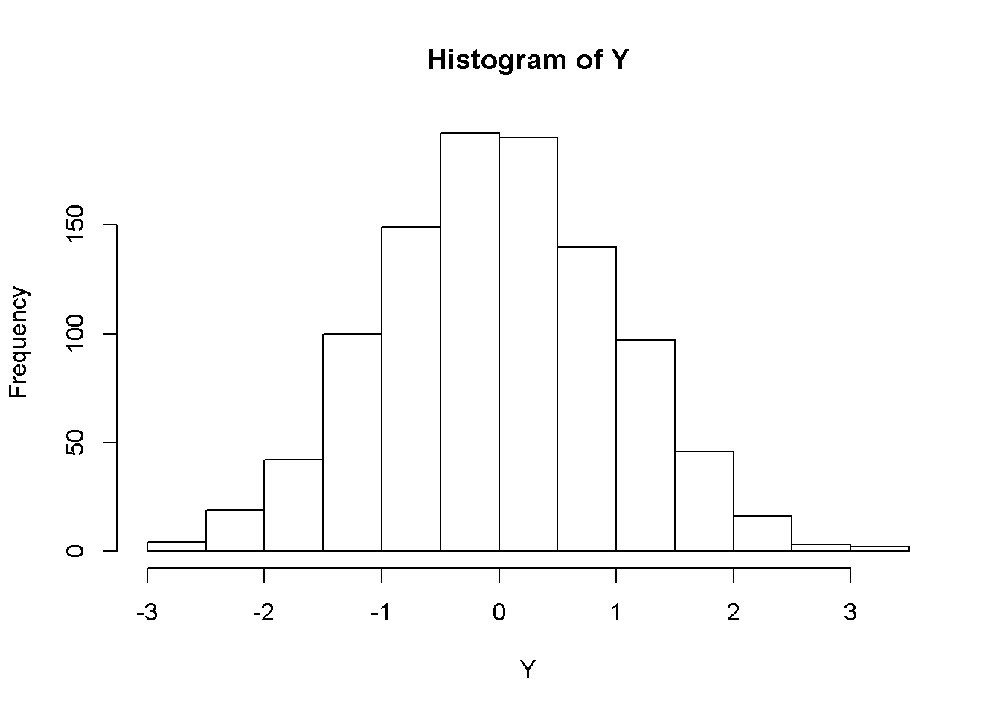

# Some basic examples {#VI}

This chapter presents some examples of text output generated by the `VI()` command of the `BrailleR` package. These examples generate output that is displayed in the R session just like any output from standard R commands. Please note however that not all `VI()` commands behave in this fashion; some more advanced uses of `VI()` are discussed in later chapters. 


You will need the `BrailleR` package to be ready for use to follow along with the examples in this chapter. Do this by issuing the command `library(BrailleR)` now.


## Accessibility of graphics in statistical software

Access to graphical representations of information from mathematical or statistical software is quite limited, and therefore limits the blind user's capacity. To this author's knowledge, no mathematical or statistical software has the capability of directly linking to any hardware or software solutions that make the information presented in graphs immediately available. The scalable vector graphic (SVG) format can be used to present a graphic with text embedded into the file for creating access for a blind user [@BulatovGardner2004SVG; @GardnerBulatov2010SVG]. 
Only a small number of statistical software applications have the capacity to create SVG files, but this capacity does not in itself create access because the text that makes them accessible must be added somehow; generally this is a  manual process. The World Wide Web Consortium has a recommendation on the use of SVGs in web content [@SVGStandard] and a number of add-on packages for R make use of SVG because of the opportunity to enrich a graphic's interactivity in webpages; see  [@MurrellPotter2014] for a more detailed discussion of these packages and their functionality. Of particular note is that there are different ways to create an SVG and care must be taken if the maximum accessibility for blind users is ever to be achieved.

In R, a graph can be saved as an SVG using the `svg()` command, but this approach  uses the Cairo SVG format; this has the unfortunate outcome that text is not always preserved as a string, and some shapes are represented by an unstructured set of straight lines [@GardnerBulatov2010SVG]. 
Retention of text as strings is crucial if modifications such as changing the font of any text to the  braille font of a user's choosing is to be managed easily. 
Use of the `gridSVG` package [@MurrellPotter2014] does lead to creation of SVG files that do keep strings of text intact and a hierarchy of graphical elements. These SVG files are more easily modified to create accessibility for blind users that have the technology to interpret them [@GardnerBulatov2010SVG].  
Any graph created in R using functions from the `graphics` package will need to be converted to the `grid` package system for generating graphics through use of the `gridGraphics` [@Murrell2015GridGraphics] package before they are exported in SVG format. Existence of the `gridSVG` and `gridGraphics`  packages means that it should be possible to automate the creation and addition of the necessary text information to the SVG so that the need for  human intervention is minimised.


Add-on scripts for screen reader software, such as JAWS [@JAWS], that attempt to interpret the graphs created by common spreadsheet software has been tried in the past. 
One major problem that results from the creation of these add-on scripts is that of maintenance; unfortunately, the add-on scripts for screen reader software support of spreadsheet applications has not kept pace with the developments of those applications sufficiently enough to give blind people access to the full range of graphs. Sporadic effort has been made at providing access to statistical software through the creation of add-on scripts for screen readers, but little effort was ever given to creating access to the content of graphics. It is unfortunate that these have also not been sufficiently maintained. In this respect the use of R or SAS currently hold an advantage over other commonly used software (notably SPSS and Minitab) for the blind user because no additional scripts for the screen reading software are required. [@GodfreyLoots2014JSS]. R and SAS also work well with the open source screen reader called NVDA [@NVDA].


In conclusion, it seems  that until such time as adaptive technology for creating immediate access via tactile images is commonly available, other solutions will continue to be relevant. In fact, even once the immediacy issue is overcome, there will be a place for solutions such as the `BrailleR` package as a complementary solution rather than a substitute.


At each of the Summer University and Blind Science Conference  events I have shown students that they could use R to gain access to graphed information in a manner almost unparalleled by other statistical software --- the obvious exception to this rule is S-PLUS [@SPLUS-Soft]. 
This advantage comes from the fact that the S language, on which R is built, implicitly stores the data needed to create many  graphs, and this data can be assigned to an object for further manipulation. 
This is not true for graphs created using the ubiquitous `plot()` function however, and many other plotting functions that explicitly return a `NULL` object. We will first look at a graph object that can be explicitly stored. 

## Histograms

The first and most commonly used example demonstrating the value of the BrailleR  package to a blind user is the creation of a histogram. For example, a sighted user wanting a histogram of 1000 randomly chosen values from a standard normal distribution would type


```r
Y = rnorm(1000)
HIST = hist(Y)
```

<div class="figure">

<p class="caption">(\#fig:hist)A histogram of 1000 random values from a normal distribution</p>
</div>
A simple way for blind users to access the information used to create a graph is to ask R to print the object, using the `print()` command. 

```r
print(HIST)
```

```
$breaks
 [1] -3.5 -3.0 -2.5 -2.0 -1.5 -1.0 -0.5  0.0  0.5  1.0  1.5  2.0  2.5  3.0  3.5

$counts
 [1]   1   5  19  48  78 140 202 195 147 105  42  14   3   1

$density
 [1] 0.002 0.010 0.038 0.096 0.156 0.280 0.404 0.390 0.294 0.210 0.084 0.028
[13] 0.006 0.002

$mids
 [1] -3.25 -2.75 -2.25 -1.75 -1.25 -0.75 -0.25  0.25  0.75  1.25  1.75  2.25
[13]  2.75  3.25

$xname
[1] "Y"

$equidist
[1] TRUE

$ExtraArgs
$ExtraArgs$main
[1] "Histogram of Y"

$ExtraArgs$xlab
[1] "Y"

$ExtraArgs$ylab
[1] "Frequency"

$ExtraArgs$sub
[1] ""


$NBars
[1] 14

$par
$par$xaxp
[1] -3  3  6

$par$yaxp
[1]   0 200   4


$xTicks
[1] -3 -2 -1  0  1  2  3

$yTicks
[1]   0  50 100 150 200

attr(,"class")
[1] "Augmented" "histogram"
```

The `print()` command can be wrapped around the `hist()` command which avoids explicit storage of the object, but still creates the histogram. This approach can be taken for many graph types where the option of suppressing the graph is not available. The `hist` command gives the user an explicit way of generating the information a blind user may want. Similar functionality exists using the `boxplot.stats()` command for example. Such workhorse functionality is useful but not well-documented.

Given the user has stored the output from the `hist()` function in an object, they can interpret the text to gain some idea of what appears in the histogram. As the object is designed for compatibility and flexibility,  not all of the printed information is relevant to the end user however so some further education or perhaps further processing is still required. I found that some blind users had no appreciation for what a histogram actually looks like. In hindsight, this was reasonable because the way R presents a histogram (and many other graphs) does differ from presentations of the same data in other software.

This "print it out" approach is workable but is far from elegant. On some occasions the data structure listed is just a list of the actual data itself and is therefore not giving blind users the same information as sighted users get from a graph. Blind users need some sort of summarisation tool to replace the graph, and in many instances, are unlikely to have the skill to develop a sound statistical solution for themselves. It is also reliant on users knowing what the various elements printed out are, and how they link to the visual object created for the sighted world. The initial aim of the `BrailleR` package was to take the information created by various functions in R and create a text printout that reduces the amount of information that needs to be processed by blind users. 
In cases like that for the histogram example just introduced, this is a fairly simple task.
For other situations, some further work needs to be done so that the textual information is a useful summary of the graphical information without crossing over the line of interpreting the information for the user.  

So let's see what `BrailleR` is going to offer a blind user instead of the verbose printout seen above. First, the `Describe()` function describes a histogram in a  general sense.

```r
Describe(HIST)
```

```
A histogram created using the base graphics package.

General description: A histogram uses rectangles to represent the counts or relative frequencies of observations falling in each subrange of the numeric variable being investigated. The rectangles are standing side by side with their bottom end at the zero mark of the vertical axis. The widths of the rectangles are usually constant, but this can be altered by the user. A sighted person uses the heights and therefore the areas of the rectangles to help determine the overall shape of the distribution, the presence of gaps in the data, and any outliers that might be present.
As with most graphs created by the base graphics package, the axes do not join at the bottom left corner and are separated from the area where the data are being plotted. Tick marks are automatically chosen for the data, and the axes may not extend past the ends of variables being plotted.The vertical axis for frequency always starts at zero.
R normally plots a graph in a square window. This can be altered; the way this is done depends heavily on the method being used to create the graph. See the help on win.graph() or  x11() for the graphs made in an interactive  session or part of an R script; png(), pdf() or postscript() for specific file formats being created; or, use fig.height and fig.width arguments in your R markdown documents.

R hints: If you intend to make a tactile version of a histogram, you may find it useful to alter the aspect ratio so that the histogram is wider than it is tall.
```

Then, we can find out what is shown in the specific histogram using the `VI()` function.

```r
VI(HIST)
```

```
This is a histogram, with the title: Histogram of Y
"Y" is marked on the x-axis.
Tick marks for the x-axis are at: -3, -2, -1, 0, 1, 2, and 3 
There are a total of 1000 elements for this variable.
Tick marks for the y-axis are at: 0, 50, 100, 150, and 200 
It has 14 bins with equal widths, starting at -3.5 and ending at 3.5 .
The mids and counts for the bins are:
mid = -3.25  count = 1 
mid = -2.75  count = 5 
mid = -2.25  count = 19 
mid = -1.75  count = 48 
mid = -1.25  count = 78 
mid = -0.75  count = 140 
mid = -0.25  count = 202 
mid = 0.25  count = 195 
mid = 0.75  count = 147 
mid = 1.25  count = 105 
mid = 1.75  count = 42 
mid = 2.25  count = 14 
mid = 2.75  count = 3 
mid = 3.25  count = 1
```

The `Describe()` and `VI()` commands actually call the `Describe.histogram()` and `VI.histogram()` commands because R knows it is a histogram that was generated by `hist()` earlier. 

### Important features

The commands used above explicitly stored the histogram. A blind user could use `VI(hist(y))` instead to get the same outcome. In that case, 
the `VI()` command would add to the impact of issuing the `hist()` command because the graphic is still generated for the sighted audience. 
The blind user can then read from the text description so that they can interpret the information that the histogram offers the sighted world.

### Warning

The `VI()` function is partially reliant on the use of the `hist()` function that is included in the `BrailleR` package. If a histogram is created using a command that directly links to the original `hist()` command found in the `graphics` package, then the `VI()` command's output will not be as useful to the blind user. This mainly affects the presentation of the title and axis labels; it should not affect the details of the counts etc. within the histogram itself.

This behaviour could arise if the histogram is sought indirectly. If for example, a function offers (as a side effect) to create a histogram, the author of the function may have explicitly stated use of the `hist()` function from the `graphics` package using `graphics::hist()` instead of `hist()`. Use of `graphics::hist()` will bypass the `BrailleR::hist()` function that the `VI()` command needs. This should not create error messages, but may result in some strange and possibly undesirable output.


## Basic numerical summaries

The standard presentation of a summary of a data frame where each variable is given its own column is difficult for a screen reader user to read as the processing of information is done line by line. For example:


```r
summary(airquality)
```

```
     Ozone           Solar.R           Wind             Temp      
 Min.   :  1.00   Min.   :  7.0   Min.   : 1.700   Min.   :56.00  
 1st Qu.: 18.00   1st Qu.:115.8   1st Qu.: 7.400   1st Qu.:72.00  
 Median : 31.50   Median :205.0   Median : 9.700   Median :79.00  
 Mean   : 42.13   Mean   :185.9   Mean   : 9.958   Mean   :77.88  
 3rd Qu.: 63.25   3rd Qu.:258.8   3rd Qu.:11.500   3rd Qu.:85.00  
 Max.   :168.00   Max.   :334.0   Max.   :20.700   Max.   :97.00  
 NA's   :37       NA's   :7                                       
     Month            Day      
 Min.   :5.000   Min.   : 1.0  
 1st Qu.:6.000   1st Qu.: 8.0  
 Median :7.000   Median :16.0  
 Mean   :6.993   Mean   :15.8  
 3rd Qu.:8.000   3rd Qu.:23.0  
 Max.   :9.000   Max.   :31.0  
                               
```

The `VI()` command actually calls the `VI.data.frame()` command. It then processes each variable one by one so that the results are printed  variable by variable instead of summary statistic by summary statistic. For example:

```r
VI(airquality)
```

```

The summary of each variable is
Ozone: Min. 1   1st Qu. 18   Median 31.5   Mean 42.1293103448276   3rd Qu. 63.25   Max. 168   NA's 37  
Solar.R: Min. 7   1st Qu. 115.75   Median 205   Mean 185.931506849315   3rd Qu. 258.75   Max. 334   NA's 7  
Wind: Min. 1.7   1st Qu. 7.4   Median 9.7   Mean 9.95751633986928   3rd Qu. 11.5   Max. 20.7  
Temp: Min. 56   1st Qu. 72   Median 79   Mean 77.8823529411765   3rd Qu. 85   Max. 97  
Month: Min. 5   1st Qu. 6   Median 7   Mean 6.99346405228758   3rd Qu. 8   Max. 9  
Day: Min. 1   1st Qu. 8   Median 16   Mean 15.8039215686275   3rd Qu. 23   Max. 31  
```


### Important features

Note that in this case, the blind user could choose to present the summary of each variable as generated by the `VI()` command, or the output from the standard `summary()` command. There is no difference in the information that is ultimately presented in this case.


## BrailleR commands used in this chapter

The only explicit commands from the `BrailleR` package used in this chapter were the `Describe()` and `VI()` commands.
