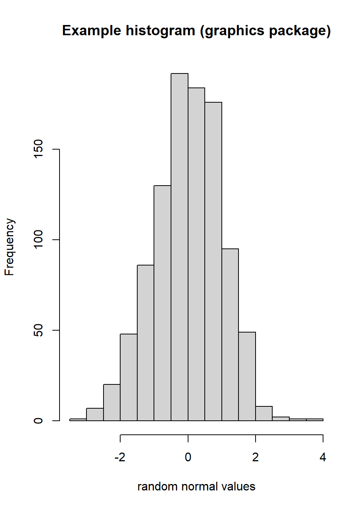

# New BrailleR commands for making and interpreting basic graphs {#NewGraphs}


This chapter introduces two types of new commands found in the `BrailleR` package. There are several commands to help a blind user know what is included in a graph, starting with a tool to help "know" what is displayed in an otherwise inaccessible graphics device window. The other commands introduced in this chapter are substitutes for functions found in the base distribution of R. You can jump ahead to the examples, but there is some theory needed to explain how the `BrailleR` package does the extra work it does, and why we need to use these substitute commands.


You will need the `BrailleR` package to be ready for use to follow along with the examples in this chapter. Do this by issuing the command `library(BrailleR)` now.

## What's in a graph?


A challenge for many blind people is to understand the way a scatter plot shows a relationship between two variables. In a theoretical sense they can learn that a scatter plot does show a relationship, outliers etc. but the ability to construct a scatter plot for themselves and then interpret it in a similar way to their sighted peers is not possible unless they have direct access to a tactile image embosser. Such access is not immediate as embossers are not portable. Although efforts to create tools that can be used by blind people who do not have access to an embosser are not new [@CalderEtAl2006], more recent developments have tended to focus on use of touch screen technologies. To this author's knowledge, no comprehensive solution exists to meet the need for blind users to independently create statistical graphs with confidence or to modify  them without starting all over again.

Solutions for giving blind people access (in a general sense) are often aimed at providing an exact replica of what the sighted person can see. A statistical graph can exist on two levels: First, the exact detail of individual elements that are plotted in the graph, and second, the combined effect this collection of elements conveys.

As we look at the various graphs being produced in any analysis, we need to think about which of these activities is being done by the sighted world as they consume the content. If we do not understand what the consumer is doing, we cannot hope to provide an appropriate graph for them; to be a producer of a graph, you must also be a consumer of it, albeit temporarily. The solutions offered to blind users by `BrailleR` try to keep this ethos in mind.
 
## Background

In Chapter \@ref(VI), we saw creation of a histogram using the `hist()` command. The `hist()` command used for many years is found in the `graphics` package and has its own `plot()` command called `plot.histogram()` as well. This `plot()` command is actually a family of commands that all start with`plot.*()` where the star is replaced by the type of object that is being plotted. We use this `plot()` command all the time to give us plots for different reasons. When we fit a regression model, we need to create various plots of the residuals and it is done using `plot()` which actually employs `plot.lm()` in the background to do the work. The family of commands are referred to as "methods" and the types of objects being worked on are called "classes".  We need a little more background before diving into the various new commands BrailleR offers.

### Methods and classes

Development of the `BrailleR` Package and discussion of its opportunities is totally reliant on two of the structures used in the S language. 
These are "methods" and "classes". 
In brief, a set of commands that perform a  similar task on a selection of different classes is a "method". 

Methods and classes are important ideas because we can write a method function that says how we want an object with a stated class to be processed. Methods need classes, and we wouldn't need classes if we didn't hope to use methods.

When we create a histogram with the `hist()` command we can store an object of class "histogram", and when we create a regression model using `lm()` we create an object of class "lm". 
The `hist()` command does create an object with the class attribute set to `histogram`, but  only one specific function exists for this class, that being the `plot.histogram()`  function to plot the histogram. 
Sighted users don't need an explicit print function for a histogram, nor does this summary graph need further summarisation.


Tasks that warrant a method being written for each of a variety of classes include:

- we might need a function to print the object out in an easy to use fashion. This happens all the time, but most R users just take it for granted that the output looks the way it does. In fact, the output is formatted behind the scenes.
- we may need to plot the results in a graph. A simple `plot()` command does all sorts of different things. Novice users just watch the magic without asking how it happens.
- we may need to create a different kind of object that summarizes the original object in some way. This is already done using the `summary()` function, but that simple `summary()` command is actually a set of functions for different classes.

 These are just three tasks common to objects of many classes. There is nothing stopping any R user  from writing a method to handle a variety of classes or adding to the methods that already exist.

A complete method will have a base function that informs the software that there is a family of functions written for different classes, and that a method has been written for the default action, which is applied if no specific method exists for a class. For example, the print method includes specific functions:  `print()`, `print.default()`, `print.matrix()`, and many more.
If we issue the command `print(x)`, and we know that `x` is a matrix, the `print()` method will employ the `print.matrix()` function to display the matrix. The example given in Chapterthat printed the results of the histogram object used the `print.default()` function as there is no `print.histogram()` function in existence.


Many R commands do lead to an object being created with a class attribute being explicitly stated, sometimes it is more implicit, but all too commonly no class attribute is established at all.  The vast majority of statistical models set a class for the model being stored. There are some quite uninformative classes set as well.
Assigning a class to an object means that we can write functions that relate to all objects of a particular class using a general approach. A class therefore needs to be defined for a set of objects that are going to be homogeneous in their structure.

Data is usually stored with a specified class attribute, such as a time series with class "ts" for example.  We will generate different results from employing methods if we have correctly specified the data using a class attribute. We can also modify a data object's class, using commands like `as.tx()` to turn a vector of numbers into a time series if we need to do so to get the desired outcome.
 
A data.frame is itself of  class "data.frame", a matrix is of class "matrix", but rather confusingly,  a vector is not of class "vector". Vectors are assigned class attributes that depend on the type of data being stored, being "integer", "numeric", "logical", "character", etc.

As previously stated, the usefulness of methods is dependent on the use of classes being employed when objects are created. 
The original `hist()` command does specify the resulting histogram to have a class, but there is no explicit `print.histogram()` method at this time. 
In addition, not all objects are given a class so the default method must be constructed carefully. 
There are actually only a few basic data structures to work with, the easiest and most common of which is called a "list". 

The results of applying the `print()` command to a histogram shown in Chapter \@ref(VI), couldn't use the non-existent `print.histogram()` function so it used the `print.default()` method instead. The content of the object is stored as a "list", but note the last element of the list that states the class of the object. Adding this extra attribute to the data object is a minor matter that has very powerful consequences!


### Who cares about classes anyway?

It is a reasonable question to ask. 
BrailleR cares because the functions written such as the `VI()` command used throughout   Chapter \@ref(VI) is actually a family of commands. 
The beginnings of the `BrailleR` Project were formed on the idea of writing a method that would provide the summarised text version of the graph object created. To this end, a method was started with the functions: `VI()`, `VI.default()`, and `VI.histogram()` in order to demonstrate the approach.
The `VI()` commands called actually refered to the `VI.histogram()` and `VI.data.frame()` commands to generate output that is sensitive to the object of interest.


So for the `VI()` command to do the processing necessary to extract the information that is pushed into a graphic or textual output, we need to know what kind of object was being created. For the examples shown in Chapter \@ref(VI), that was done with the standard R commands used when creating the histogram and the data.frame we used. Well that's almost true. The standard `hist()` command from the base distribution of R does assign the class "histogram" to the stored object, but it doesn't have all the necessary information in it to replicate a plotted histogram. The solution is to create a new `hist()` command in the `BrailleR` package that does all the work of the original function and does add the details we want to help describe the histogram being plotted.


## Example: A histogram

One of the easiest ways to demonstrate code snippets is to include them in the help documentation of the function. Running these examples is then possible using the `example()` command. 
In this example, we see that use of the original `hist()` from the `graphics` package yields the same graph as the `BrailleR` package version, but that the additional text for such items as titles and axis labelling used in the text description are only added by `BrailleR::hist()`. Running the command, `example(hist)` command will give you the following:

```

> x = rnorm(1000)

> MyHist = graphics::hist(x, xlab = "random normal values", 
+     main = "Example histogram (graphics package)")
```

<div class="figure">

<p class="caption">(\#fig:exampleHist1)testing examples</p>
</div>

```

> MyHist
$breaks
 [1] -3.5 -3.0 -2.5 -2.0 -1.5 -1.0 -0.5  0.0  0.5  1.0  1.5  2.0  2.5  3.0

$counts
 [1]   1   4  19  27  94 188 193 185 138  87  29  24  11

$density
 [1] 0.002 0.008 0.038 0.054 0.188 0.376 0.386 0.370 0.276 0.174 0.058 0.048
[13] 0.022

$mids
 [1] -3.25 -2.75 -2.25 -1.75 -1.25 -0.75 -0.25  0.25  0.75  1.25  1.75  2.25
[13]  2.75

$xname
[1] "x"

$equidist
[1] TRUE

attr(,"class")
[1] "histogram"

> MyHist = hist(x, xlab = "random normal values", main = "Example histogram (BrailleR package)")
```

<div class="figure">

<p class="caption">(\#fig:exampleHist2)testing examples</p>
</div>

```

> MyHist
$breaks
 [1] -3.5 -3.0 -2.5 -2.0 -1.5 -1.0 -0.5  0.0  0.5  1.0  1.5  2.0  2.5  3.0

$counts
 [1]   1   4  19  27  94 188 193 185 138  87  29  24  11

$density
 [1] 0.002 0.008 0.038 0.054 0.188 0.376 0.386 0.370 0.276 0.174 0.058 0.048
[13] 0.022

$mids
 [1] -3.25 -2.75 -2.25 -1.75 -1.25 -0.75 -0.25  0.25  0.75  1.25  1.75  2.25
[13]  2.75

$xname
[1] "x"

$equidist
[1] TRUE

$main
[1] "Example histogram (BrailleR package)"

$xlab
[1] "random normal values"

$ExtraArgs
$ExtraArgs$main
[1] "Histogram of x"

$ExtraArgs$xlab
[1] "x"

$ExtraArgs$ylab
[1] "Frequency"

$ExtraArgs$sub
[1] ""


$NBars
[1] 13

$par
$par$xaxp
[1] -3  3  6

$par$yaxp
[1]   0 200   4


$xTicks
[1] -3 -2 -1  0  1  2  3

$yTicks
[1]   0  50 100 150 200

attr(,"class")
[1] "Augmented" "histogram"

> VI(MyHist)
This is a histogram, with the title: Histogram of x
"x" is marked on the x-axis.
Tick marks for the x-axis are at: -3, -2, -1, 0, 1, 2, and 3 
There are a total of 1000 elements for this variable.
Tick marks for the y-axis are at: 0, 50, 100, 150, and 200 
It has 13 bins with equal widths, starting at -3.5 and ending at 3 .
The mids and counts for the bins are:
mid = -3.25  count = 1 
mid = -2.75  count = 4 
mid = -2.25  count = 19 
mid = -1.75  count = 27 
mid = -1.25  count = 94 
mid = -0.75  count = 188 
mid = -0.25  count = 193 
mid = 0.25  count = 185 
mid = 0.75  count = 138 
mid = 1.25  count = 87 
mid = 1.75  count = 29 
mid = 2.25  count = 24 
mid = 2.75  count = 11
```

When you first issued the `library(BrailleR)` command, there were several warnings printed out. One of them told you that the `hist()` function from the `graphics` package was masked by the `BrailleR` version. This means that when you use `hist()`, it is the `BrailleR` version being used.

the `BrailleR` package includes `hist()` and `boxplot()` functions that pass the details of the command on to the `graphics` package functions of the same name, and then add any additional content required that will improve the ability to describe the visual graphic produced in text. In most cases, the graph producing functions pass on arguments such as `main`, `xlab`, or `ylab` (for main title and axis labels) to the relevant plotting commands without storing these elements in the object that is created. These elements are stored as graphical parameters and can be recalled using `par()` commands. 

## Scatter plots

The description of the `hist()` function given above shows what is possible if a graph is created using a specific function. Many types of graphs are created using the `plot()` function which is actually a family of functions tailored to the type of object pushed into them. In addition, the `plot()` command is used to generate a simple scatter plot. This is slightly unfortunate in a theoretical sense, but useful in a practical sense. The use of `plot()` to generate a scatter plot cannot lead to a graph that the `VI()` functionality can work with. Unlike the `hist()` command which can be replaced by a function of the same name in the `BrailleR` package, the solution needs to be a new function of a new name. In addition to the new `ScatterPlot()` function, the `BrailleR` package has a `FittedLinePlot()` function that adds a fitted line to the scatter plot. 

The example given on the help page for `ScatterPlot()` proves that the plots generated by `ScatterPlot()` and `FittedLinePlot()` are identical to those that would normally be created using `plot()` and the addition of the fitted line using `abline()`. Running the command, `example(ScatterPlot)` command will give you the following:


```

> attach(airquality)

> op = par(mfcol = c(3, 2))

> plot(Wind, Ozone, pch = 4)
```

```

> test1 = ScatterPlot(Wind, Ozone, pch = 4)
```

```

> test1
```

```

> plot(Wind, Ozone)
```

```

> abline(coef(lm(Ozone ~ Wind)), col = 4)

> test2 = FittedLinePlot(Wind, Ozone, line.col = 4)
```

```

> test2
```

<div class="figure">

<p class="caption">(\#fig:exampleScatterPlot)The six graphs generated by the `example(ScatterPlot)`</p>
</div>

```

> par(op)

> detach(airquality)

> rm(test1)

> rm(test2)

> rm(op)
```


### What's in the scatter plot?


Well first we might ask what is in the graph window to be confident that a plot was actually made. The `WTF()` command was put in `BrailleR` to address this problem. For the record, WTF is the acronym for "What's this figure?" We'll see it's use in the next figure. It should tell us what appears in the graph window for things like axis lables and titles.

The  current solution offered by the `BrailleR` package for helping describe the points plotted in a  scatter plot, is to attempt to replicate the summarisation done by sight using a text construct. A sighted person looking at a scatter plot might look at the trend being displayed by a set of points, but they might as easily partition the plot area into a grid pattern and recognize the density of points in each region. For example,


```r
attach(airquality)
plot(Wind, Ozone, pch = 4)
abline(v=min(Wind)+c(0.25,0.5,0.75)*(max(Wind)-min(Wind)), col=6)
abline(h = min(Ozone, na.rm=TRUE) +c(0.25,0.5,0.75)*(max(Ozone, na.rm=TRUE)-min(Ozone, na.rm=TRUE)), col=6)
WTF()
```

<div class="figure">

<p class="caption">(\#fig:addGridLines)Scatter plot of Ozone versus Wind with grid lines added.</p>
</div>

```
This graph has no main title;  and o subtitle;
"Wind" as the x axis label;
"Ozone" as the y axis label;
There are 116 points marked on this graph.
```

```r
detach(airquality)
```

Counting the number of points falling into each cell of the graphic and presenting the results as  a table would give the reader an impression of the density of those points. The grid lines added in this last figure were spaced uniformly, and chosen to split the region into a $4\times4$ grid of sixteen cells. 
Refining the number of cells and the distributional assumptions for the grid lines should make it easier to understand the relationship between the two variables being plotted. Note that the general picture is what is sought, not the specific locations of every point. The number of points for the last scatter plot are counted by the `WhereXY()` command as follows:


```r
attach(airquality)
WhereXY(Wind, Ozone, grid = c(4,4))
```

```
     1  2  3 4 Sum
4    2  0  0 0   2
3    7  5  0 0  12
2    9 15  6 0  30
1    1 39 27 5  72
Sum 19 59 33 5 116
```

```r
detach(airquality)
```

In situations where the user is confident that the marginal distributions of either or both of the variables being plotted are normal, the grid lines should be spaced accordingly. 


## BrailleR commands used in this chapter

The BrailleR versions of the `hist()` and  `boxplot()` commands replace those found in the `graphics` package. The BrailleR commands `ScatterPlot()` and `FittedLinePlot()` are specific to BrailleR and replace the functionality usually obtained through use of `plot()` and `abline()`. The `WTF()` command helped prove a graph has appeared in the graph window, and `WhereXY()` has helped count the number of points falling into subregions of the plotting area.


