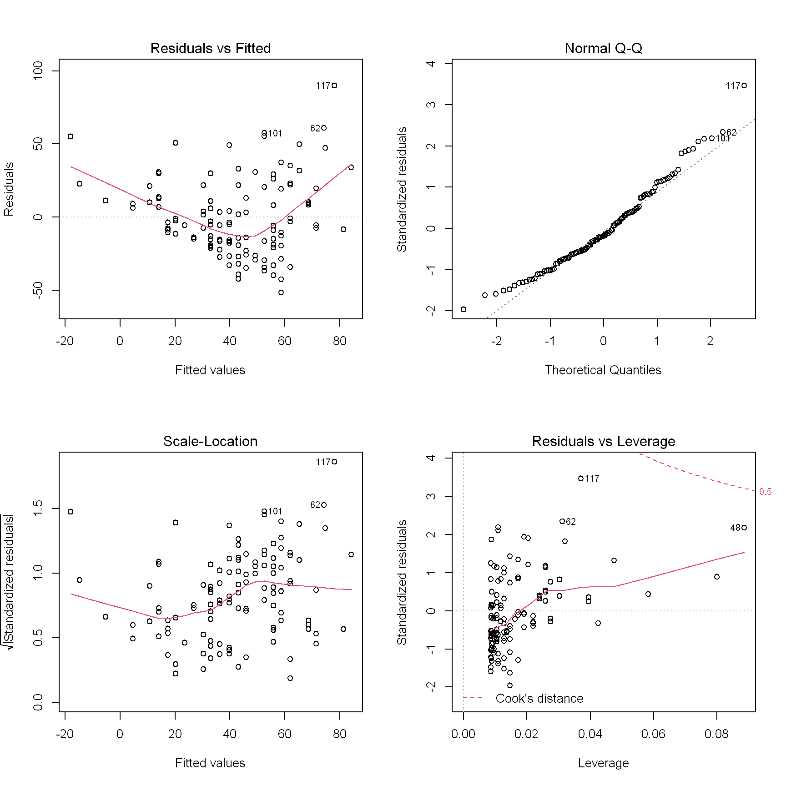

# Use of R markdown to generate an analysis efficiently {#RMarkdown} 

In a general sense, R markdown has been used to create reports and package vignettes because it creates an analysis that is reproducible. The `BrailleR` package started to use R markdown in late 2014 as a method for generating simple analyses that might be needed by students taking introductory statistics courses. Since that time, the prevalence of R markdown as a teaching tool in these courses has increased. The functions described below are therefore also generating example R markdown files to help learn how to use R markdown. The workflow illustrated in this chapter is also the workflow used to create this book. It is heavily reliant on the work of Yihui Xie, much of which can be found in [@Xie2015].


You will need the `BrailleR` package to be ready for use to follow along with the examples in this chapter. Do this by issuing the command `library(BrailleR)` now.


## General information

Each command described in this chapter and other similar commands draft a new R markdown file and then compile it to an HTML file that is easily read by a screen reader user. They make extensive use of the `knitr` package [@Rpkg-knitr] to process R commands and retrieve the R output and graphs, and then the `rmarkdown` package [@Rpkg-rmarkdown] to process the markdown content of the raw input file into HTML (or other file types if we wanted them).
 
This HTML file is opened automatically if R is being used interactively, giving the blind user immediate access to the information. The content is automatically presented using sufficiently marked up HTML code including headings and tables so that the blind user can make best use of their  screen reading software. All graphs are given an "alt tag" when they are included in the HTML file, and can be presented using a text description available from the `VI()` functionality of the `BrailleR` package.

In addition, the blind user may need one or more of the graphs in a variety of formats (png, pdf, eps, or svg), nicely formatted tables for insertion into documents (LaTeX or HTML), and access to the code that generated these graphs and tables (an R script). 
This is handled using add-on packages wherever possible so that blind users are completing tasks using the same tools as their sighted peers. For example, nicely tabulated results can be saved as individual text files for later inclusion in LaTeX documents using the `xtable` package [@Rpkg-xtable].


The commands shown in this chapter make use of R markdown, but  they  are not actually ready for direct use within other R markdown documents. 
If you wish to get the output you observe within the HTML documents that will be generated, you will need to extract the relevant parts of the R markdown script files that the commands create. That sounds harder than it is!


## Replacing the Graphic User Interface (GUI)

One major criticism of R often heard from novice users is that a graphic user interface (GUI) is much easier to use than the command line mode of operation. Blind users are no different in this respect, but as has been reported previously [@GodfreyRJournal], none of the GUI-based front ends for R are accessible to the blind user. 
When considering the benefits of using a GUI mode of operation, we turn to the justification used for the creation of some of these interfaces; redacting all references to the GUI helps emphasize the reasons for their existence: 

-  R Commander aims "to support ... the statistical functionality required for a basic-statistics course; to make it relatively difficult to do unreasonable things; 
and to render visible the relationship between choices made ...  
and the R commands that they generate." [@Fox2005-RCommander].
-  "Because R analyses must be called as text commands, the user is required to find out the name of the function that will accomplish their task, and then remember that name along with the names of the variables to feed it, and its argument options. Perhaps more fundamentally, many users have never dealt with a program that requires them to type in commands that manipulate objects in the program. 
For beginners, Deducer is designed to be an intuitive dialog based interface to common data manipulation and analysis tasks. " [@Fellows2012Deducer]
-  "The scope of RKWard is deliberately broad, targeting both R novices and experts. For the first group, the aim is to allow any person with knowledge on statistical procedures to start using RKWard for their everyday work without having to learn anything about the R programming language, at least initially. At the same time, RKWard tries to support users who want to learn and exploit the full flexibility of the R language for automating or customizing an analysis. " [@RoedigerEtAl2012RKWard]
-  RKWard "avoids wrapping complex sequences of data manipulation or analysis into custom highlevel R functions. The task of providing high-level functions is logically independent of the development of the GUI frontend, and should best be addressed in dedicated R packages, where 
necessary." [@RoedigerEtAl2012RKWard]


Making any of these GUI tools accessible is 
difficult because they were not developed using interface development toolkits that automatically build  accessibility into the interface. 
Creation of a GUI such as R Commander is not a small undertaking. Retrospectively building in the necessary accessibility features would be a massive undertaking that the blind community could not reasonably expect of a very small development team. Duplicating the work done to create such a GUI tool from scratch using a development toolkit that helps build in the necessary elements for accessibility and then maintaining it as operating systems develop over time is not a practical solution either. It may be possible to improve the toolkits that are used to create the GUI options like R Commander or Deducer so that their development is not hindered while their accessibility becomes automatic; unfortunately, this requires knowledge well beyond my skill set.

If blind users cannot make use of any of the GUI tools and we don't have the necessary skills to develop such a tool that does work for ourselves, what solutions exist for us? When I've discussed the merits of various statistical software with other blind users, they have questioned the use of R by saying something like, "When  I use software *x*, I can do *y* and *z*. How do I do that in R?" With respect to SAS for example, a user can build up a set of templates for various commonly used analyses for themselves. The same is true as an R user, but SAS users can get the templates by using the menus in the standard GUI,  and they can keep the procedures in files for later use. SPSS users can do this as well. (These seem to be the most commonly used software options for blind users who communicate with me.) In either case, the code can be reused after issuing a few find/replace searches. It seems that even though it is more efficient to make use of this ability to re-use code templates, that many of the blind users of these software options prefer to use key presses to simulate mouse clicks in order to use the menus and dialogue boxes. When questioning them on their motives, we quickly come to the point that the use of menus and dialogue boxes offers a degree of comfort that  tasks have been done correctly. The next crucial aspect worth mentioning is that the GUI provides the user with more output than can be obtained from typing out numerous commands in R. Searching for the right functions and then ensuring the syntax of their arguments is correct limits a blind user's ability in any command-line software, just as it does for sighted users. 

The solution for a replacement of the GUI is to create convenience functions with simple names that require entry of a minimal number of arguments so  that the user gets the maximum amount of useful information. This information might prove more than is needed for many users, but hopes to deliver what is needed by the widest possible range of blind users. 
Like RKWard, `BrailleR` functions generate R scripts that are somewhat verbose [@RoedigerEtAl2012RKWard].

## Description of a single numeric variable

There are many commands needed to get the numeric and graphic summary measures that might be required to collect all relevant information on a single numeric variable. The `UniDesc()` command has been written as a shortcut for a blind user who wishes to obtain:

- the counts of points in the sample that were observed and not observed,
- the mean and trimmed mean,
- the five number summary: minimum, lower quartile, median, upper quartile, and maximum,
- the interquartile range (IQR) and standard deviation,
- measures of skewness and kurtosis, relying on the `moments` package [@Rpkg-moments],
- a histogram and/or a boxplot,
- a normality (quantile-quantile) plot,
- various tests for normality, courtesy of the `nortest` package [@Rpkg-nortest] , and
- tests on the significance of the skewness and kurtosis, also courtesy  of the `moments` package [@Rpkg-moments].

The `UniDesc()` function can deliver all of this with minimal effort from the user.

An example of the main output document (HTML) can be viewed by re-issuing the commands generated by calling  

```r
example(UniDesc)
```
while running R interactively. This issues the following commands.


```

Ozone=airquality$Ozone
UniDesc(Ozone)
rm(Ozone)
# N.B. Various files and a folder were created in the working directory. 
# Please investigate them to see how this function worked.
```


As an alternative, and if you do have a current internet connection you can view the result of running the [`UniDesc()` command on the Ozone data](https://R-Resources.massey.ac.nz/BrailleRInAction/Ozone-UniDesc.html) in your browser without having to re-enter the example commands. You can also view the [R markdown script created by  `UniDesc(Ozone)`](Ozone-UniDesc.Rmd)  which starts with the following lines:


````
# Univariate analysis for Ozone 
#### Prepared by Jonathan Godfrey   

```{r setup, purl=FALSE, include=FALSE}
library(BrailleR)
opts_chunk$set(dev=c("png", "pdf", "postscript", "svg"))
opts_chunk$set(comment="", echo=FALSE, fig.path="Ozone/Ozone-", fig.width=7)
```  

## Basic summary measures

```{r BasicSummaries}
Ozone.count = length(Ozone)
Ozone.unique = length(unique(Ozone))
Ozone.Nobs = sum(!is.na(Ozone))
Ozone.Nmiss = sum(is.na(Ozone))
Ozone.mean = mean(Ozone, na.rm = TRUE)
Ozone.tmean5 = mean(Ozone, trim =0.025, na.rm = TRUE)
Ozone.tmean10 = mean(Ozone, trim =0.05, na.rm = TRUE)
Ozone.IQR = IQR(Ozone, na.rm = TRUE)
Ozone.sd = sd(Ozone, na.rm = TRUE)
Ozone.var = var(Ozone, na.rm = TRUE)
Ozone.skew = moments::skewness(Ozone, na.rm = TRUE)
Ozone.kurt = moments::kurtosis(Ozone, na.rm = TRUE)
``` 
... ... ...
````


The document header includes a code chunk that sets the options for the `knit2html()` process used to convert this file to HTML. 
This processing allows for:

-  multiple file types for the graphs, 
- ensures a minimum of extra text in the output,
- hides the R code from the HTML file,
- sets the location of the saved graphs, and
-  establishes the height of the figures.
 
The user that does not like these settings can edit the markdown file for themselves and re-process the file, but the intention is to deliver more than all users would want so that as many users as possible get what they need. 


This R markdown script uses the `VI()` method for the graphs as well as the code that generates the HTML (via markdown) and LaTeX tables (using the `xtable` package). Take note of the arguments supplied to the code chunks for the graphs; these include a `fig.cap` which is used as an Alt tag in the resulting HTML files. The quoted string is the only text that is read aloud by a blind person's screen reading software as they move the cursor onto the graph while reading through the HTML document. The methods used for creating tables in markdown (either directly or using the `kable()` command from the `knitr` package) [@Rpkg-knitr] both lead to a formatted HTML table that is easily navigated by a screen reader using keystrokes that help move between rows or columns. The result is that the HTML document is about as user-friendly as can be expected for a blind user. It is important to recognize that some of the text  is arranged for the optimal use by a blind person; it is possible to alter the cosmetics of the HTML document without altering the experience for blind users. Given a blind user might be accompanied by sighted classmates, teaching staff, or colleagues, making the HTML pages presentable is desirable; this has been achieved using a custom style sheet (CSS) included in the package. This style includes some color, adequate spacing of content and other features that improve the clarity of the presented material which is important for a user with some residual vision that wishes to read through the results visually rather than using screen reading software. 


If all of the optional arguments of the `UniDesc()` function are set at their defaults, the HTML file is automatically opened in a browser (courtesy of the `View` argument); it puts the R markdown file, the R script, and the HTML document in the current working directory, while the LaTeX and graph files  are all placed in a subdirectory.

Several other convenience functions have been created that follow the same process as the `UniDesc()` function. The `OneFactor()` function compares one continuous response variable to a categorical variable, while `TwoFactors()` allows for two categorical variables and their possible interaction to help explain a single continuous response variable. These functions create group summary statistics and suitable graphs that a sighted audience might expect to see. Comparing a continuous response variable to a continuous predictor variable is achieved using the `OnePredictor()` function. Each of these functions has an example using data from the `datasets` package [@Rpkg-datasets] so a user can see what can be expected from these functions.

## Analysis of a single continuous variable with respect to a single grouping factor

There are many commands needed to get the numeric and graphic summary measures that might be required to collect all relevant information on a single numeric variable when it might depend on a  grouping factor. The `OneFactor()` command has been written as a shortcut for a blind user who wishes to obtain:

- the counts of observations within each group,
- the mean, standard deviation and standard error for each group,
- comparative boxplots and/or dotplots, 
- the one-way analysis of variance, and
- Tukey's Honestly Significant Difference (HSD) test on the significance of the between group differences.


An example of the main output document (HTML) can be viewed by re-issuing the commands generated by calling  

```r
example(OneFactor)
```
while running R interactively. This issues the following commands.


```

data(airquality)

# the following line  returns an error:
## OneFactor("Ozone", "Month", airquality, View=FALSE)
# so we make a copy of the data.frame, and fix that:

airquality2 = airquality
airquality2$Month = as.factor(airquality$Month)
# and now all is good to try:
OneFactor("Ozone", "Month", airquality2)
# N.B. Various files and a folder were created in the working directory. 
# Please investigate them to see how this function worked.
```

As an alternative, and if you do have a current internet connection you can view the result of running the [`OneFactor()` command on the Ozone data](https://R-Resources.massey.ac.nz/BrailleRInAction/Ozone.Month-OneFactor.html) in your browser without having to re-enter the example commands.

The example here demonstrates the point that the grouping variable must be a factor. The month variable is not stored as a factor in the airquality data so its use would have created an error.

## Use of BrailleR for linear regression 


Linear regression is almost always taught using graphical techniques, especially for the validation of the model being fitted. Of particular note is the way an instructor would teach sighted students about the sensibility of fitting any line to some data which cannot be easily judged even using the `WhereXY()` function described earlier. A blind student lacking an embosser to produce a tactile image that shows the fitted line and the data, will almost certainly need to fit the model and see how good or bad it is. These blind students are therefore even more reliant on the residual analysis than their sighted classmates

The `VI()` command can be applied to a linear model object. The specific function to do this is found in the `VI.lm()` function, but most users do not need to explicitly use `VI.lm()` because the call to `VI()` will know to use the `VI.lm()` function if it is the right one to use at the time.

The `VI.lm()` function generates so much text as a substitute for the graphs used by sighted users, that it is easier to put this text in an HTML document and have that new document opened in a browser instead of trying to use a screen reader within the R session.

Let's see an example using the `airquality` data. 
Please note: The example is chosen for reproducibility and its lack of statistical validity, as this is the best way to demonstrate the function's value to a blind user. 
A simple linear regression model might be created and investigated using:

```r
data(airquality)
MyModel = lm(Ozone~Wind, data=airquality)
summary(MyModel)
```

```

Call:
lm(formula = Ozone ~ Wind, data = airquality)

Residuals:
    Min      1Q  Median      3Q     Max 
-51.572 -18.854  -4.868  15.234  90.000 

Coefficients:
            Estimate Std. Error t value Pr(>|t|)    
(Intercept)  96.8729     7.2387   13.38  < 2e-16 ***
Wind         -5.5509     0.6904   -8.04 9.27e-13 ***
---
Signif. codes:  0 '***' 0.001 '**' 0.01 '*' 0.05 '.' 0.1 ' ' 1

Residual standard error: 26.47 on 114 degrees of freedom
  (37 observations deleted due to missingness)
Multiple R-squared:  0.3619,	Adjusted R-squared:  0.3563 
F-statistic: 64.64 on 1 and 114 DF,  p-value: 9.272e-13
```

```r
par(mfrow=c(2,2))
plot(MyModel)
```

<div class="figure">

<p class="caption">(\#fig:AirQuality.lm)Diagnostic plots for the simple linear regression model.</p>
</div>


The user now has a model stored as `MyModel` in the current workspace, has printed a summary of that model, and has plotted a set of four diagnostic plots in a $2\times{}2$ grid. The blind user will still need to issue those commands so that the output is created to meet the expectations of the sighted audience, but will also find value in issuing the two extra commands

```r
VI(MyModel)
VI(summary(MyModel))
```
The use of the second of these commands will generate

```
The term which is significant to 1% is
Wind with an estimate of -5.550923 and P-Value of 9.271974e-13 
```
which will be a much easier reading exercise for a screen reader user than would be the standard `summary()` output given earlier. Note that not all the information contained in the standard summary is contained in this output.

The output from use of the `VI()` command on the linear model can be viewed in your browser if you have a current internet connection. If you do not have a connection at this time, you will need to re-issue some of the above commands for yourself in an R session.

The HTML document created by `VI.lm()` is based on the results of the `UniDesc()` function applied to the Pearson residuals for the model and a number of other graphs and tables used to validate the model. The included graphs are of the residuals plotted against the fitted values, the order the data were collected (assumes data are presented in this order), the leverages,  and the  preceding residual.
Each of these graphs is subjected to scrutiny using the `WhereXY()` function as described earlier. The marginal distribution of the residuals is assumed normal while the fitted values and leverages are categorized on the basis of a uniform distribution. The assumption of normality for residuals is immediately obvious, but the choice to explicitly use an incorrect assumption of  uniformity for the other values needs to be justified. While these quantities aare unlikely to be uniformly distributed, the intended audience needs to know about the pattern of their presentation on the graph; this should be easier to understand if the categorization is done using uniform spacing rather than another distribution that is unfamiliar to the intended audience.

A table of unusual observations is created that uses rules of thumb for magnitude of residuals, leverages, and Cook's distances. This table is presented in the HTML document and converted to a LaTeX file using the `xtable` package. The raw LaTeX for this table looks like:


```
% latex table generated in R 3.5.1 by xtable 1.8-2 package
% Wed Aug 15 11:59:08 2018
\begin{table}[ht]
\centering
\begin{tabular}{rrrrrrr}
  \hline
 & Ozone & Wind & Fit & St.residual & Leverage & Cooks.distance \\ 
  \hline
9 &     8 & 20.1000 & -14.7007 & 0.8934 & 0.0799 & 0.0347 \\ 
  18 &     6 & 18.4000 & -5.2641 & 0.4370 & 0.0582 & 0.0059 \\ 
  22 &    11 & 16.6000 & 4.7276 & 0.2408 & 0.0395 & 0.0012 \\ 
  48 &    37 & 20.7000 & -18.0312 & 2.2149 & 0.0885 & 0.2304 \\ 
  62 &   135 & 4.1000 & 74.1141 & 2.3847 & 0.0312 & 0.0880 \\ 
  86 &   108 & 8.0000 & 52.4655 & 2.1428 & 0.0110 & 0.0247 \\ 
  101 &   110 & 8.0000 & 52.4655 & 2.2233 & 0.0110 & 0.0265 \\ 
  117 &   168 & 3.4000 & 77.9998 & 3.6474 & 0.0370 & 0.2309 \\ 
  121 &   118 & 2.3000 & 84.1058 & 1.3164 & 0.0475 & 0.0430 \\ 
  126 &    73 & 2.8000 & 81.3303 & -0.3204 & 0.0426 & 0.0023 \\ 
  148 &    14 & 16.6000 & 4.7276 & 0.3561 & 0.0395 & 0.0026 \\ 
   \hline
\end{tabular}
\caption{Listing of suspected outliers and influential observations.} 
\label{InflObsMyModel}
\end{table}
```


Note that the automatic formatting of this table as performed by  the `xtable` package has not been altered to meet a specified publication style. Ultimatly, users will need to alter the presentation to meet publisher specifications for themselves. 

## Analysis of a single continuous variable with respect to another continuous variable

The `OnePredictor()` command is similar to the `OneFactor()` command describe earlier in this chapter and makes use of the `VI()` command as applied to the simple linear regression model fitted to a pair of continuous variables, one of which is determined to respond to the other.
The `OnePredictor()` command has been written as a shortcut for a blind user who wishes to obtain:

- the counts of observations within each group,


An example of the main output document (HTML) can be viewed by re-issuing the commands generated by calling  

```r
example(OnePredictor)
```
while running R interactively. This issues the following commands.


```

data(airquality)
OnePredictor("Ozone", "Wind", airquality)
# N.B. Various files and a folder were created in the working directory. 
# Please investigate them to see how this function worked.
```


As an alternative, and if you do have a current internet connection you can view the result of running the [`OnePredictor()` command on the Ozone data](https://R-Resources.massey.ac.nz/BrailleRInAction/Ozone-OnePredictor.html) in your browser without having to re-enter the example commands.


## BrailleR commands used in this chapter


The first two `BrailleR` commands introduced in this chapter were the `UniDesc()` and `OneFactor()` commands; they used the `VI()` command in the R markdown files that they create, as was described back in Chapter \@ref(VI), to give the text descriptions for graphs. We then saw a new use of the `VI()` command and several other commands designed to generate common analyses quickly. These included the `OnePredictor()` command which speeds up the presentation of a simple linear regression model. This function also creates an R markdown script which then makes an HTNML file for immediate use, and various files with tables and graphs commonly needed for simple linear regression. The specific command `VI.lm()` is an example of the `VI()` command tailored to  linear models and their analysis. Consideration of the validity of linear models is generally done via graphs so the `WhereXY()` command introduced in Chapter \@ref(NewGraphs) is applied in a variety of ways.

## References
