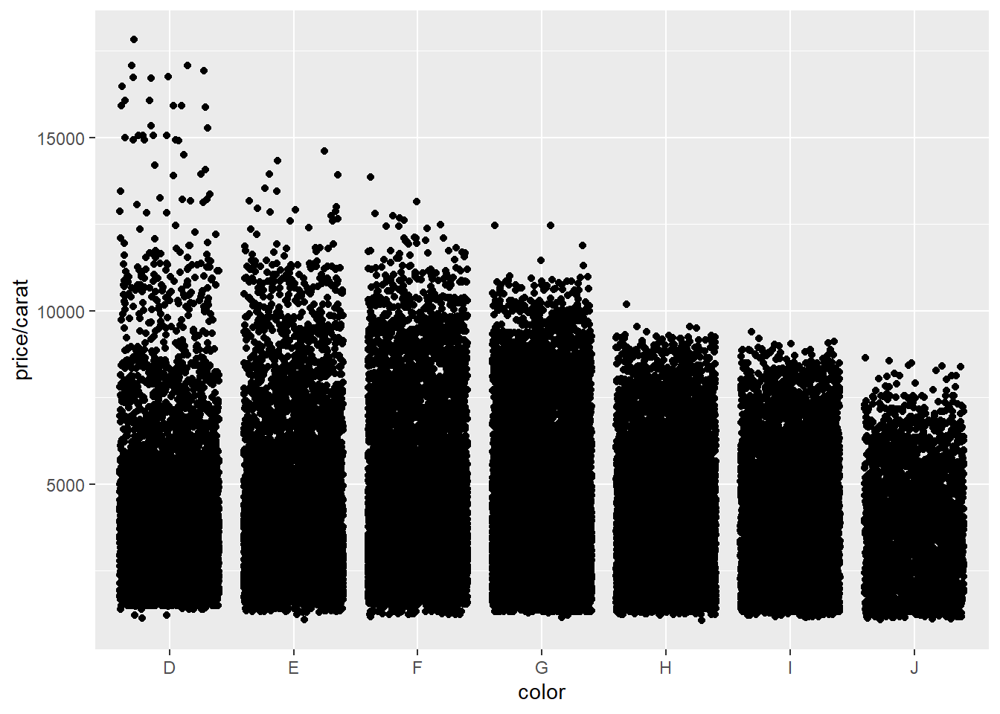
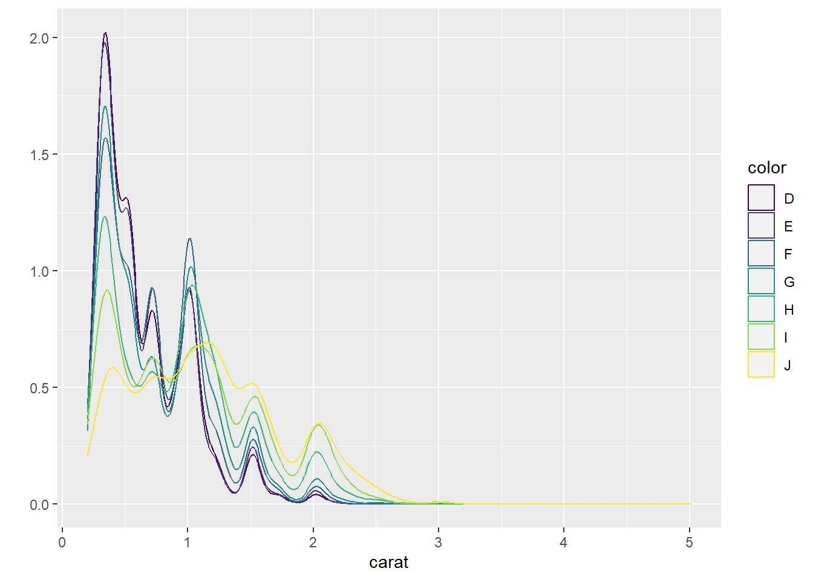
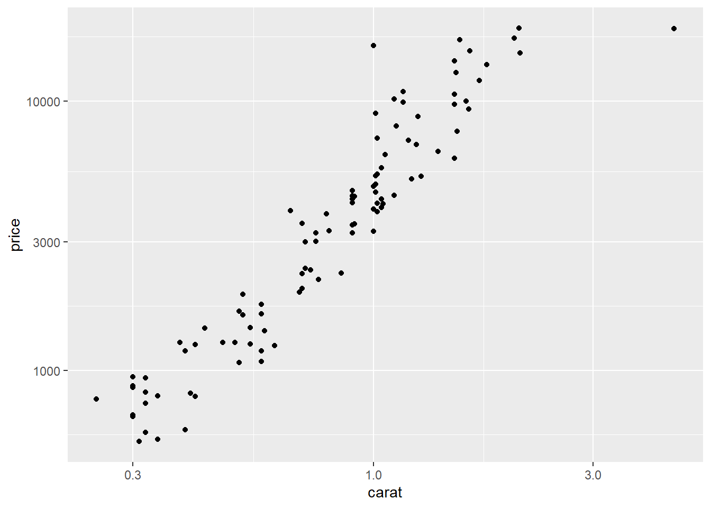

# The ggplot world and BrailleR {#GGPlot}


The use of the ggplot style of graph production has increased markedly since its inception. The grammar of graphics as seen in the R code used to create the extremely wide range of graphs is seldom human-interpretable with ease. Creation of suitable support functionality via the `VI()` command is very definitely required. An initial attempt to extract any useful infromation from these graphs was contributed to the `BrailleR` package by Tony Hirst. Significant improvement has been made by Debra Warren as part of her postgraduate work under the supervision of Paul Murrell at the University of Auckland. Much of what is displayed in this chapter is only worth offering because of Debra's work and the interactions had between her, Paul and I in the second half of 2017.


N.B.  the commands here are exact copies of the commands presented in @Wickham2009ggplot2 or some minor alterations to them; any changes will be explicitly noted.    All plots are created using the figure numbers from @Wickham2009ggplot2 or the page numbers if no figure number was given. They are then investigated using the `VI()` command from the `BrailleR` package.


You will need some additional packages to the `BrailleR` package to be ready for use to follow along with the examples in this chapter. Do this by issuing the commands:


```r
library(BrailleR)   
library(ggplot2)   
```

```

Attaching package: 'ggplot2'
```

```
The following objects are masked from 'package:BrailleR':

    xlab, ylab
```

```r
library(magrittr)
```

Note that one data set used for these examples is created by @Wickham2009ggplot2 while the others are included in the `ggplot2` package.

```r
set.seed(1410)
dsmall <- diamonds[sample(nrow(diamonds), 100),]   
```


One important note for the graphs in this chapter is the difference in the way they appear here,  as compared to the original figures of @Wickham2009ggplot2 where differing height and width parameters have been set for each graph. For example,  in the following graph, the points are smaller than in the original figure, and the aspect ratio is slightly different. The consequence is that this graph looks less cluttered than does the original.


```r
p11a = qplot(carat, price, data = diamonds)   
p11a
```

<div class="figure">

<p class="caption">(\#fig:p11a)First graph on page 11 of @Wickham2009ggplot2</p>
</div>

```r
VI(p11a)  
```

```
This is an untitled chart with no subtitle or caption.
It has x-axis 'carat' with labels 0, 1, 2, 3, 4 and 5.
It has y-axis 'price' with labels 0, 5000, 10000 and 15000.
The chart is a set of 53940 points.
```

Note that unlike some other ways the `VI()` command has worked, the graph was not created by the nesting of the call to render the graph when nested inside the `VI()` command. In all the examples that follow, I use the pipe `%>%` operator from the `magrittr` package to push the graph into the `VI()` function.


```r
fig2.2a = qplot(carat, price, data = dsmall, colour = color)
fig2.2a %>% VI()   
```

```
This is an untitled chart with no subtitle or caption.
It has x-axis 'carat' with labels 0.5, 1.0, 1.5, 2.0 and 2.5.
It has y-axis 'price' with labels 0, 5000, 10000 and 15000.
There is a legend indicating that colour is used to represent color, with 7 levels:
D represented by colour very deep purple, 
E represented by colour vivid purplish blue, 
F represented by colour moderate blue, 
G represented by colour vivid bluish green, 
H represented by colour brilliant green, 
I represented by colour vivid yellow green and 
J represented by colour vivid greenish yellow.
The chart is a set of 100 points.
```

```r
fig2.2a
```

<div class="figure">

<p class="caption">(\#fig:fig2-2a)Left pane of Figure 2.2 of @Wickham2009ggplot2</p>
</div>

We haven't been able to tell what exact colour was used in the @Wickham2009ggplot2 rendering of this graph,  but there has obviously been some minor alteration of the colour palette being used by the `ggplot2` package.


```r
fig2.2b = qplot(carat, price, data = dsmall, shape = cut)    
fig2.2b %>% VI()   
```

```
Warning: Using shapes for an ordinal variable is not advised
```

```
This is an untitled chart with no subtitle or caption.
It has x-axis 'carat' with labels 0.5, 1.0, 1.5, 2.0 and 2.5.
It has y-axis 'price' with labels 0, 5000, 10000 and 15000.
There is a legend indicating that shape is used to represent cut, with 5 levels:
Fair represented by shape solid circle, 
Good represented by shape solid triangle, 
Very Good represented by shape solid square, 
Premium represented by shape plus and 
Ideal represented by shape boxed X.
The chart is a set of 100 points.
```

```r
fig2.2b
```

```
Warning: Using shapes for an ordinal variable is not advised
```

<div class="figure">

<p class="caption">(\#fig:fig2-2b)Right pane of Figure 2.2</p>
</div>

To get semi-transparent points:   

```r
fig2.3b = qplot(carat, price, data = diamonds, alpha = I(1/100))    
fig2.3b
```

<div class="figure">

<p class="caption">(\#fig:fig2-3b)Middle pane from Figure 2.3</p>
</div>

```r
fig2.3b %>% VI()   
```

```
This is an untitled chart with no subtitle or caption.
It has x-axis 'carat' with labels 0, 1, 2, 3, 4 and 5.
It has y-axis 'price' with labels 0, 5000, 10000 and 15000.
The chart is a set of 53940 points.
The chart has alpha set to 0.01.
```

To add a smoother (default is loess for n<1000):   

```r
fig2.4a = qplot(carat, price, data = dsmall, geom = c("point", "smooth"))    
fig2.4a
```

```
`geom_smooth()` using method = 'loess' and formula 'y ~ x'
```

<div class="figure">

<p class="caption">(\#fig:fig2-4a)Left pane of Figure 2.4</p>
</div>

```r
fig2.4a %>% VI()   
```

```
This is an untitled chart with no subtitle or caption.
It has x-axis 'carat' with labels 0.5, 1.0, 1.5, 2.0 and 2.5.
It has y-axis 'price' with labels 0, 5000, 10000, 15000 and 20000.
It has 2 layers.
Layer 1 is a set of 100 points.
Layer 2 is a smoothed curve using method 'auto' with confidence intervals.
```


## Plotting a  continuous variable against a categorical variable  


```r
fig2.8a  = qplot(color, price / carat, data = diamonds, geom = "jitter")
fig2.8a
```

<div class="figure">

<p class="caption">(\#fig:fig2-8a)Left pane of Figure 2.8</p>
</div>

```r
fig2.8a %>% VI()   
```

```
This is an untitled chart with no subtitle or caption.
It has x-axis 'color' with labels D, E, F, G, H, I and J.
It has y-axis 'price/carat' with labels 5000, 10000 and 15000.
The chart is a set of 53940 points.
```


```r
fig2.8b = qplot(color, price / carat, data = diamonds, geom = "boxplot")    
fig2.8b
```


```r
fig2.8b %>% VI()   
```

```
This is an untitled chart with no subtitle or caption.
It has x-axis 'color' with labels D, E, F, G, H, I and J.
It has y-axis 'price/carat' with labels 5000, 10000 and 15000.
The chart is a boxplot comprised of 7 boxes with whiskers.
There is a box at x=D.
It has median 3410.53. The box goes from 2455 to 4749.31, and the whiskers extend to 1128.12 and 8183.33.
There are 338 outliers for this boxplot.
There is a box at x=E.
It has median 3253.66. The box goes from 2430.3 to 4508.41, and the whiskers extend to 1078.12 and 7616.39.
There are 593 outliers for this boxplot.
There is a box at x=F.
It has median 3494.32. The box goes from 2587.1 to 4947.22, and the whiskers extend to 1168 and 8477.5.
There are 585 outliers for this boxplot.
There is a box at x=G.
It has median 3490.38. The box goes from 2538.24 to 5500, and the whiskers extend to 1139.02 and 9937.2.
There are 119 outliers for this boxplot.
There is a box at x=H.
It has median 3818.89. The box goes from 2396.88 to 5127.28, and the whiskers extend to 1051.16 and 9220.
There are 13 outliers for this boxplot.
There is a box at x=I.
It has median 3779.74. The box goes from 2344.65 to 5196.75, and the whiskers extend to 1151.72 and 9397.5.
There are 0 outliers for this boxplot.
There is a box at x=J.
It has median 3780. The box goes from 2562.87 to 4927.95, and the whiskers extend to 1080.65 and 8426.13.
There are 3 outliers for this boxplot.
```

When seeking to use shading or opaqueness to describe the density of the points, the fact the size of the points has an impact on the opaqueness is not realised by `BrailleR`. 

```r
fig2.9b = qplot(color, price / carat, data = diamonds, geom = "jitter", alpha = I(1 / 50))    
fig2.9b
```

<div class="figure">

<p class="caption">(\#fig:fig2-9b)Middle pane of Figure 2.9</p>
</div>

```r
fig2.9b %>% VI()   
```

```
This is an untitled chart with no subtitle or caption.
It has x-axis 'color' with labels D, E, F, G, H, I and J.
It has y-axis 'price/carat' with labels 5000, 10000 and 15000.
The chart is a set of 53940 points.
The chart has alpha set to 0.02.
```


### univariate plots   


```r
fig2.10a = qplot(carat, data = diamonds, geom = "histogram")    
fig2.10a
```

```
`stat_bin()` using `bins = 30`. Pick better value with `binwidth`.
```

<div class="figure">

<p class="caption">(\#fig:fig2-10a)Left pane of Figure 2.10</p>
</div>

```r
fig2.10a %>% VI()   
```

```
This is an untitled chart with no subtitle or caption.
It has x-axis 'carat' with labels 0, 1, 2, 3, 4 and 5.
It has y-axis '' with labels 0, 5000, 10000 and 15000.
The chart is a bar chart containing 30 vertical bars.
```
Warning: This figure does look different to the original in @Wickham2009ggplot2 ins spite of using the same code and same data.


```r
fig2.10b = qplot(carat, data = diamonds, geom = "density")    
fig2.10b
```

<div class="figure">

<p class="caption">(\#fig:fig2-10b)Right pane of Figure 2.10</p>
</div>

```r
fig2.10b %>% VI()   
```

```
This is an untitled chart with no subtitle or caption.
It has x-axis 'carat' with labels 0, 1, 2, 3, 4 and 5.
It has y-axis '' with labels 0.0, 0.5, 1.0 and 1.5.
The chart is a type that VI isn't able to process.
```


```r
fig2.11c = qplot(carat, data = diamonds, geom = "histogram", binwidth = 0.01, xlim = c(0,3))    
fig2.11c
```

```
Warning: Removed 32 rows containing non-finite values (stat_bin).
```

<div class="figure">

<p class="caption">(\#fig:fig2-11c)Right pane of Figure 2.11</p>
</div>

```r
fig2.11c %>% VI()   
```

```
Warning: Removed 32 rows containing non-finite values (stat_bin).
```

```
This is an untitled chart with no subtitle or caption.
It has x-axis 'carat' with labels 0, 1, 2 and 3.
It has y-axis '' with labels 0, 1000 and 2000.
The chart is a bar chart containing 299 vertical bars.
```

The data is separated by implication in the following graphs. The legend is automatically generated and has altered in appearance since the original was prodcued in @Wickham2009ggplot2.


```r
fig2.12a = qplot(carat, data = diamonds, geom = "density", colour = color)    
fig2.12a
```

<div class="figure">

<p class="caption">(\#fig:fig2-12a)Left pane of Figure 2.12</p>
</div>

```r
fig2.12a %>% VI()   
```

```
This is an untitled chart with no subtitle or caption.
It has x-axis 'carat' with labels 0, 1, 2, 3, 4 and 5.
It has y-axis '' with labels 0.0, 0.5, 1.0, 1.5 and 2.0.
There is a legend indicating that colour is used to represent color, with 7 levels:
D represented by colour very deep purple, 
E represented by colour vivid purplish blue, 
F represented by colour moderate blue, 
G represented by colour vivid bluish green, 
H represented by colour brilliant green, 
I represented by colour vivid yellow green and 
J represented by colour vivid greenish yellow.
The chart is a type that VI isn't able to process.
```


```r
fig2.12b = qplot(carat, data = diamonds, geom = "histogram", fill = color)    
fig2.12b
```

```
`stat_bin()` using `bins = 30`. Pick better value with `binwidth`.
```

<div class="figure">

<p class="caption">(\#fig:fig2-12b)Right pane of Figure 2.12</p>
</div>

```r
fig2.12b %>% VI()   
```

```
This is an untitled chart with no subtitle or caption.
It has x-axis 'carat' with labels 0, 1, 2, 3, 4 and 5.
It has y-axis '' with labels 0, 5000, 10000 and 15000.
There is a legend indicating that fill is used to represent color, with 7 levels:
D represented by fill very deep purple, 
E represented by fill vivid purplish blue, 
F represented by fill moderate blue, 
G represented by fill vivid bluish green, 
H represented by fill brilliant green, 
I represented by fill vivid yellow green and 
J represented by fill vivid greenish yellow.
The chart is a bar chart containing 210 vertical bars.
```

### bar charts for categorical variables   


```r
fig2.13a  = qplot(color, data = diamonds, geom = "bar") #geom="bar" is the default    
fig2.13a
```

<div class="figure">

<p class="caption">(\#fig:fig2-13a)Left pane of Figure 2.13</p>
</div>

```r
fig2.13a %>% VI()   
```

```
This is an untitled chart with no subtitle or caption.
It has x-axis 'color' with labels D, E, F, G, H, I and J.
It has y-axis '' with labels 0, 3000, 6000 and 9000.
The chart is a bar chart containing 7 vertical bars.
Bar 1 is centered horizontally at D, and spans vertically from 0 to 6775.
Bar 2 is centered horizontally at E, and spans vertically from 0 to 9797.
Bar 3 is centered horizontally at F, and spans vertically from 0 to 9542.
Bar 4 is centered horizontally at G, and spans vertically from 0 to 11292.
Bar 5 is centered horizontally at H, and spans vertically from 0 to 8304.
Bar 6 is centered horizontally at I, and spans vertically from 0 to 5422.
Bar 7 is centered horizontally at J, and spans vertically from 0 to 2808.
```


need to check...


```r
fig2.13b = qplot(color, data = diamonds, geom = "bar", weight = carat)   
fig2.13b
```

<div class="figure">

<p class="caption">(\#fig:fig2-13b)Right pane of Figure 2.13</p>
</div>

```r
fig2.13b = qplot(color, data = diamonds, geom = "bar", weight = carat) + scale_y_continuous("carat")    
fig2.13b
```

<div class="figure">

<p class="caption">(\#fig:fig2-13b)Right pane of Figure 2.13</p>
</div>

```r
fig2.13b %>% VI()   
```

```
This is an untitled chart with no subtitle or caption.
It has x-axis 'color' with labels D, E, F, G, H, I and J.
It has y-axis '' with labels 0, 2500, 5000 and 7500.
The chart is a bar chart containing 7 vertical bars.
Bar 1 is centered horizontally at D, and spans vertically from 0 to 4456.56.
Bar 2 is centered horizontally at E, and spans vertically from 0 to 6445.12.
Bar 3 is centered horizontally at F, and spans vertically from 0 to 7028.05.
Bar 4 is centered horizontally at G, and spans vertically from 0 to 8708.28.
Bar 5 is centered horizontally at H, and spans vertically from 0 to 7571.58.
Bar 6 is centered horizontally at I, and spans vertically from 0 to 5568.
Bar 7 is centered horizontally at J, and spans vertically from 0 to 3263.28.
```

## time series plots   

It looks like the data used in the next graph has been updated since the publication of @Wickham2009ggplot2 

```r
fig2.14a = qplot(date, unemploy / pop, data = economics, geom = "line")    
fig2.14a
```

<div class="figure">

<p class="caption">(\#fig:fig2-14a)Left pane of Figure 2.14</p>
</div>

```r
fig2.14a %>% VI()   
```

```
This is an untitled chart with no subtitle or caption.
It has x-axis 'date' with labels 1970, 1980, 1990, 2000 and 2010.
It has y-axis 'unemploy/pop' with labels 0.02, 0.03, 0.04 and 0.05.
The chart is a set of 1 line.
Line 1 connects 574 points.
```

## path plots   


```r
year <- function(x) as.POSIXlt(x)$year + 1900    
fig2.15b = qplot(unemploy / pop, uempmed, data = economics, geom = "path", colour=year(date)) 
#+ scale_area() # no longer works
fig2.15b
```

<div class="figure">

<p class="caption">(\#fig:fig2-15b)Right pane of Figure 2.15</p>
</div>

```r
fig2.15b %>% VI()   
```

```
This is an untitled chart with no subtitle or caption.
It has x-axis 'unemploy/pop' with labels 0.02, 0.03, 0.04 and 0.05.
It has y-axis 'uempmed' with labels 5, 10, 15, 20 and 25.
There is a legend indicating that colour is used to represent year(date), ranging from 1967 represented by colour dark purplish blue to 2015 represented by colour brilliant blue.
The chart is a type that VI isn't able to process.
```


## facets is the ggplot term for trellis' panels   

The aspect ratio for the plot region is something that needs to be considered. I've manually adjusted the plotting window here so that the graph more closely matches that of @Wickham2009ggplot2 but it  is not an exact match.

```r
fig2.16a = qplot(carat, data = diamonds, facets = color ~ ., geom = "histogram", binwidth = 0.1, 
xlim = c(0, 3))    
fig2.16a
```

```
Warning: Removed 32 rows containing non-finite values (stat_bin).
```

<div class="figure">

<p class="caption">(\#fig:fig2-16a)Left side of Figure 2.16</p>
</div>

```r
fig2.16a %>% VI()   
```

```
Warning: Removed 32 rows containing non-finite values (stat_bin).
```

```
This is an untitled chart with no subtitle or caption.
The chart is comprised of 7 panels containing sub-charts, arranged vertically.
The panels represent different values of color.
Each sub-chart has x-axis 'carat' with labels 0, 1, 2 and 3.
Each sub-chart has y-axis '' with labels 0, 500, 1000, 1500, 2000 and 2500.
Panel 1 represents data for color = D.
Panel 1 is a bar chart containing 29 vertical bars.
Panel 2 represents data for color = E.
Panel 2 is a bar chart containing 29 vertical bars.
Panel 3 represents data for color = F.
Panel 3 is a bar chart containing 29 vertical bars.
Panel 4 represents data for color = G.
Panel 4 is a bar chart containing 29 vertical bars.
Panel 5 represents data for color = H.
Panel 5 is a bar chart containing 29 vertical bars.
Panel 6 represents data for color = I.
Panel 6 is a bar chart containing 29 vertical bars.
Panel 7 represents data for color = J.
Panel 7 is a bar chart containing 29 vertical bars.
```


```r
fig2.16b = qplot(carat, ..density.., data = diamonds, facets = color ~ ., geom = "histogram", binwidth = 0.1, xlim = c(0, 3))   
fig2.16b
```

```
Warning: Removed 32 rows containing non-finite values (stat_bin).
```

<div class="figure">

<p class="caption">(\#fig:fig2-16b)Right side of Figure 2.16</p>
</div>

```r
fig2.16b %>% VI()   
```

```
Warning: Removed 32 rows containing non-finite values (stat_bin).
```

```
This is an untitled chart with no subtitle or caption.
The chart is comprised of 7 panels containing sub-charts, arranged vertically.
The panels represent different values of color.
Each sub-chart has x-axis 'carat' with labels 0, 1, 2 and 3.
Each sub-chart has y-axis '..density..' with labels 0.0, 0.5, 1.0, 1.5 and 2.0.
Panel 1 represents data for color = D.
Panel 1 is a bar chart containing 29 vertical bars.
Panel 2 represents data for color = E.
Panel 2 is a bar chart containing 29 vertical bars.
Panel 3 represents data for color = F.
Panel 3 is a bar chart containing 29 vertical bars.
Panel 4 represents data for color = G.
Panel 4 is a bar chart containing 29 vertical bars.
Panel 5 represents data for color = H.
Panel 5 is a bar chart containing 29 vertical bars.
Panel 6 represents data for color = I.
Panel 6 is a bar chart containing 29 vertical bars.
Panel 7 represents data for color = J.
Panel 7 is a bar chart containing 29 vertical bars.
```

## rescaling of the axes   


```r
p26a = qplot(carat, price, data = dsmall, log = "xy")   
p26a
```

<div class="figure">

<p class="caption">(\#fig:p26a)First graph on page 26 of </p>
</div>

```r
p26a %>% VI()   
```

```
This is an untitled chart with no subtitle or caption.
It has x-axis 'carat' with labels 1.
It has y-axis 'price' with labels 1000 and 10000.
The chart is a set of 100 points.
```


```r
fig3.6 = qplot(displ, hwy, data=mpg, facets =~ year) + geom_smooth()    
fig3.6
```

```
`geom_smooth()` using method = 'loess' and formula 'y ~ x'
```

<div class="figure">

<p class="caption">(\#fig:fig3-6)Figure 3.6 of </p>
</div>

```r
fig3.6 %>% VI()   
```

```
This is an untitled chart with no subtitle or caption.
The chart is comprised of 2 panels containing sub-charts, arranged horizontally.
The panels represent different values of year.
Each sub-chart has x-axis 'displ' with labels 2, 3, 4, 5, 6 and 7.
Each sub-chart has y-axis 'hwy' with labels 20, 30 and 40.
Each sub-chart has 2 layers.
Panel 1 represents data for year = 1999.
Layer 1 of panel 1 is a set of 117 points.
Layer 2 of panel 1 is a smoothed curve using method 'auto' with confidence intervals.
Panel 2 represents data for year = 2008.
Layer 1 of panel 2 is a set of 117 points.
Layer 2 of panel 2 is a smoothed curve using method 'auto' with confidence intervals.
```
